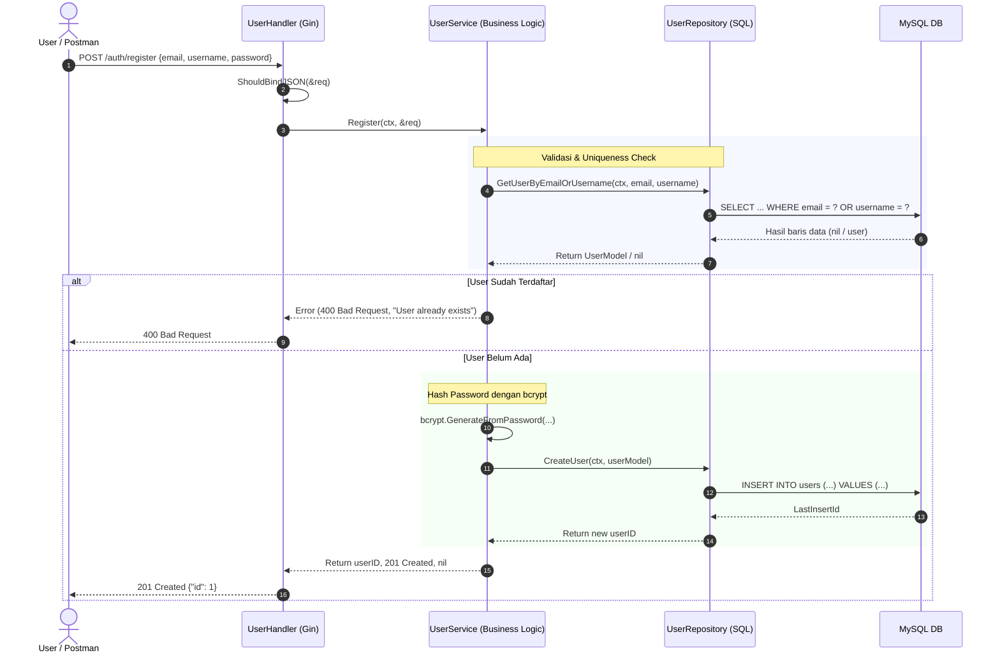

# Catatan Pembelajaran #03: Implementasi Clean Architecture, Endpoint Register User, dan Mental Model Membaca Kode Go

Dokumentasi ini mencatat rangkuman arsitektur, kode, dan konsep fundamental yang dipelajari pada tahap pembuatan fitur **Registrasi Pengguna (`POST /auth/register`)** pada project **go-tweets**.

---

## 1. Ringkasan Fitur yang Dibangun
1. **Clean Architecture Layering**: Memisahkan kode ke dalam layer Transport (Handler), Business Logic (Service), Data Access (Repository), dan Entities (Model & DTO).
2. **DTO (Data Transfer Object)**: Struct `RegisterRequest` dan `RegisterResponse` untuk memvalidasi dan mem-parsing payload JSON request.
3. **Database Layer (Repository)**:
   - `GetUserByEmailOrUsername`: Memeriksa apakah user sudah terdaftar di database MySQL.
   - `CreateUser`: Menyimpan user baru ke tabel `users` dengan Plain SQL `INSERT`.
4. **Service Layer (Business Logic)**:
   - Validasi keberadaan user agar tidak duplikat (mengembalikan `400 Bad Request`).
   - Hashing password secara aman menggunakan algoritma `bcrypt` (`golang.org/x/crypto/bcrypt`).
   - Mapping data DTO ke `UserModel` dan memanggil repository.
5. **Transport Layer (Gin Handler)**:
   - Binding JSON body menggunakan `c.ShouldBindJSON(&req)`.
   - Routing `POST /auth/register` menggunakan Gin Group Route.
6. **Manual Dependency Injection**: Merakit seluruh dependency secara eksplisit di `cmd/main.go`.

---

## 2. Tabel Analogi Konsep (Golang vs Laravel vs Next.js)

| Komponen di Fitur Ini | Padanan di Laravel | Padanan di Next.js / TypeScript | Fungsi Utama |
| :--- | :--- | :--- | :--- |
| `internal/dto/user_dto.go` | `FormRequest` | Zod Schema / Type Body DTO | Format payload JSON request & response |
| `internal/model/user_model.go` | `User` (Eloquent Model) | Prisma Schema (`User`) | Representasi entitas baris tabel di database |
| `internal/repository/user/` | Eloquent / Query Builder | Prisma / Drizzle Client | Eksekusi query SQL (`INSERT`, `SELECT`) |
| `internal/service/user/` | `UserService` / Action Class | Server Action / Lib Service | Aturan bisnis, hashing password bcrypt |
| `internal/handler/user/` | `AuthController` Method | Route Handler (`app/api/auth/register`) | Menerima HTTP, parsing body, kirim HTTP status |
| `cmd/main.go` | `AppServiceProvider` / DI Container | NestJS Module / Server bootstrap | Merakit (*wiring*) semua layer dari DB sampai Route |

---

## 3. Alur Data Runtime (Sequence Flow)



---

## 4. Panduan "Cara Baca Kodingan" & Mental Model Sintaks Go

### A. Anatomi Method Receiver (Pengganti Method Class)
```go
//                ┌─── PEMILIK METHOD (Receiver)
//                ▼
func (h *UserHandler) Register(c *gin.Context) { ... }
```
- **Cara mengeja:** *"Fungsi `Register` ini bukan fungsi mandiri biasa, melainkan method resmi milik struct `UserHandler`. Fungsi ini menerima argumen context gin `c`."*
- **Kenapa bisa dipanggil beda file?** Selama file berada dalam folder yang sama dan memiliki baris `package user` yang sama, Go menganggapnya satu kesatuan utuh. Kita bisa memecah ratusan method ke file-file terpisah (`login.go`, `register.go`) tanpa perlu `import`.

### B. Function Reference vs Eksekusi Langsung
```go
authRoute.POST("/register", h.Register)
```
- **Cara mengeja:** *"Perhatikan tidak ada tanda kurung `()` setelah `h.Register`. Ini adalah callback/referensi. Kita bilang ke Gin: daftarkan method ini, panggil nanti HANYA JIKA ada request `POST /auth/register` masuk."*

### C. Kenapa Tipe Data Pointer (`*`) vs Interface Berbeda?
```go
type userService struct {
    cfg      *config.Config         // Pakai bintang (*) karena Config adalah STRUCT
    userRepo user.UserRepository    // Tanpa bintang (*) karena UserRepository adalah INTERFACE
}
```
- **Aturan Emas:**
  - **Struct** (`config.Config`, `sql.DB`): Dioper menggunakan pointer `*` agar tidak diduplikasi di memori RAM dan menghemat resource.
  - **Interface** (`UserRepository`, `context.Context`): **Tidak boleh** memakai tanda bintang `*`. Interface di Go sudah membungkus pointer secara implisit di balik layar.

### D. Perbedaan Simbol `*` vs `&`
- **Simbol Bintang (`*`)** = Digunakan saat menuliskan **TIPE DATA**.
  Contoh: `db *sql.DB` (Tipe field ini adalah pointer ke struct `sql.DB`).
- **Simbol Dan (`&`)** = Digunakan sebagai **OPERATOR AKSI** untuk mengambil alamat memori.
  Contoh: `&userRepository{db: db}` (Buat struct sekarang, lalu ambil alamat memorinya).

### E. Peran `ctx` (`context.Context`)
`ctx` dioper di parameter pertama di semua layer (`Handler -> Service -> Repo -> SQL`):
- Berfungsi sebagai **walkie-talkie sinyal pembatalan (cancellation)**. Jika client menutup koneksi HTTP sebelum query selesai, sinyal cancel otomatis mengalir ke MySQL untuk membatalkan eksekusi query demi menghemat resource server.
- Membawa **batas waktu (timeout)** dan data khusus request (*request-scoped value*).

---

## 5. Tambahan: Request Payload Validation (`go-playground/validator/v10`)

Pada pembaruan lanjutan, validasi request ditambahkan untuk memastikan integritas input sebelum diteruskan ke layer Service.

### A. Definisi Rule di DTO (`user_dto.go`)
```go
type RegisterRequest struct {
    Email           string `json:"email" validate:"required,email"`
    Username        string `json:"username" validate:"required,min=3"`
    Password        string `json:"password" validate:"required"`
    PasswordConfirm string `json:"password_confirm" validate:"required,eqfield=Password"`
}
```
- `validate:"required,email"`: Wajib diisi dan harus format email yang sah.
- `validate:"required,min=3"`: Wajib diisi dan minimal panjang string 3 karakter.
- `validate:"required,eqfield=Password"`: Nilai harus identik dengan field struct `Password` (padanan aturan `confirmed` di Laravel atau `.refine()` di Zod).

### B. Dependency Injection Validator (`main.go`)
```go
validate := validator.New()
userHandler := userHandler.NewUserHandler(r, validate, userService)
```
Instance `validator.Validate` diinisialisasi sekali di `main()` dan di-inject ke handler sebagai pointer `*validator.Validate` demi efisiensi caching metadata struct tag.

### C. Mental Model 2 Tahap di Handler (`register.go`)
1. **Tahap 1 (`ShouldBindJSON`)**: Validasi sintaks format JSON.
2. **Tahap 2 (`validate.Struct(&req)`)**: Validasi aturan bisnis/semantik field. Jika gagal, langsung kembalikan HTTP `400 Bad Request` sebelum membebani database.
