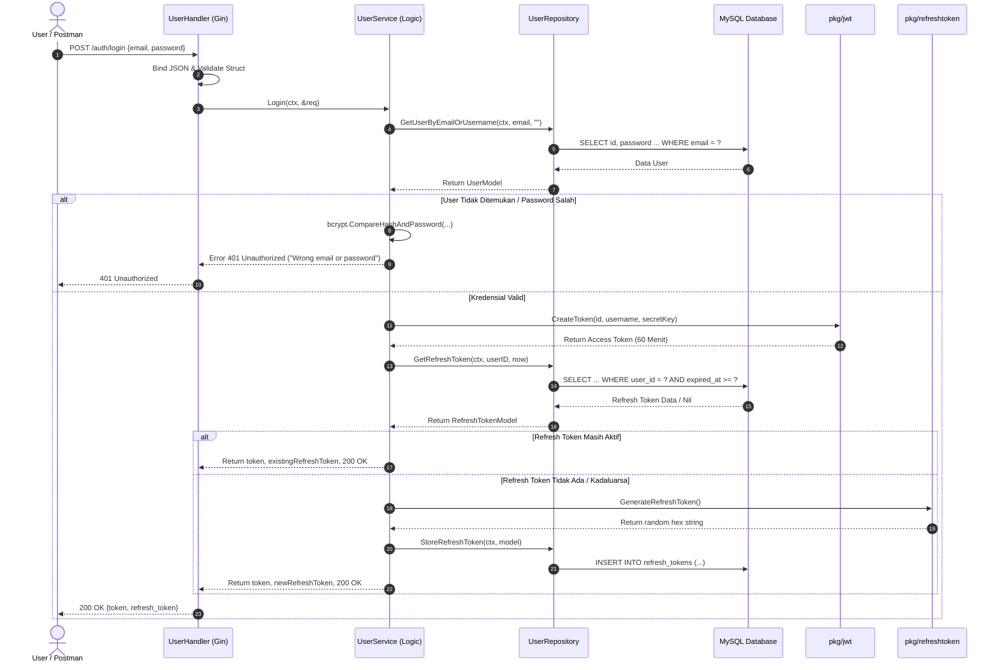

# Catatan Pembelajaran #04: Fitur Login Pengguna, Autentikasi JWT, dan Refresh Token

Dokumentasi ini mencatat rangkuman arsitektur, kode, dan konsep fundamental yang dipelajari pada tahap pembuatan fitur **Login Pengguna (`POST /auth/login`)** dengan mekanisme **Dual Token (Access Token JWT + Refresh Token)** pada project **go-tweets**.

---

## 1. Ringkasan Fitur yang Dibangun
1. **Endpoint `POST /auth/login`**: Menerima email dan password untuk autentikasi pengguna.
2. **Password Verification**: Memverifikasi kecocokan password plaintext dengan hash di database menggunakan `bcrypt.CompareHashAndPassword`.
3. **JWT Access Token Generation (`pkg/jwt`)**:
   - Dibuat menggunakan library `github.com/golang-jwt/jwt/v5`.
   - Menggunakan algoritma `HS256`.
   - Berisi claims payload: `id`, `username`, dan masa berlaku singkat (`exp: 60 menit`).
4. **Cryptographically Secure Refresh Token (`pkg/refreshtoken`)**:
   - Dibuat menggunakan `crypto/rand` (18 random bytes) lalu diubah menjadi format heksadesimal 36 karakter.
   - Masa berlaku panjang (7 hari).
5. **Database Persistence untuk Refresh Token**:
   - Menggunakan tabel `refresh_tokens` dengan kolom `expired_at`.
   - Mengecek apakah user sudah memiliki refresh token aktif yang belum expired (`expired_at >= NOW`). Jika ada, gunakan kembali; jika tidak ada, buat baru dan simpan ke database.

---

## 2. Tabel Analogi Konsep (Golang vs Laravel vs Next.js)

| Komponen di Fitur Ini | Padanan di Laravel | Padanan di Next.js / TypeScript | Fungsi Utama |
| :--- | :--- | :--- | :--- |
| `pkg/jwt/jwt.go` | `Tymon/JWTAuth` / Firebase JWT | `jsonwebtoken` / `jose` | Membuat & menandatangani token JWT (Access Token) |
| `pkg/refreshtoken/` | `Str::random(40)` / Sanctum PlainToken | `crypto.randomBytes(18)` | Membuat string unik acak aman untuk Refresh Token |
| `bcrypt.CompareHashAndPassword` | `Hash::check($password, $hash)` | `bcrypt.compare(password, hash)` | Mencocokkan hash password aman tanpa dekripsi |
| `internal/dto/user_dto.go` (`LoginRequest`) | `LoginRequest` (FormRequest) | `loginSchema` (Zod) | Validasi format payload request |
| `internal/repository/user/get_refresh_token.go` | Query Token Sanctum | `prisma.refreshToken.findFirst` | Mengambil refresh token aktif dari database |

---

## 3. Alur Data Runtime (Sequence Flow)



---

## 4. Bedah Kode & Cara Membaca Kodingannya

### A. Verifikasi Password Aman: `bcrypt.CompareHashAndPassword`
```go
err = bcrypt.CompareHashAndPassword([]byte(userExists.Password), []byte(req.Password))
if err != nil {
    return "", "", http.StatusUnauthorized, errors.New("Wrong email or password")
}
```
* **Cara membaca:** *"Bcrypt tidak pernah men-dekripsi hash password (karena hashing itu satu arah). Yang dilakukan adalah men-hash input password baru dengan `salt` yang tersimpan di dalam hash lama, lalu membandingkan hasilnya. Jika tidak cocok, Go mengembalikan error."*
* **Best Practice Keamanan:** Pesan error dibuat seragam (`"Wrong email or password"`) agar penyerang tidak bisa menebak apakah email-nya yang salah atau password-nya yang salah (*User Enumeration Attack*).

### B. Access Token JWT: `pkg/jwt/jwt.go`
```go
token := jwt.NewWithClaims(jwt.SigningMethodHS256,
    jwt.MapClaims{
        "id":       id,
        "username": username,
        "exp":      time.Now().Add(60 * time.Minute).Unix(),
    },
)
tokenStr, err := token.SignedString([]byte(secretKey))
```
* **Cara membaca:**
  - `SigningMethodHS256`: Menggunakan algoritma tanda tangan simetris HMAC-SHA256.
  - `MapClaims`: Payload data yang dibungkus di dalam token (bisa dibaca publik via decode base64, jadi **jangan letakkan password atau data rahasia di sini!**).
  - `exp`: Waktu kadaluarsa dalam format Unix Epoch Timestamp (detik).
  - `SignedString`: Menandatangani header dan payload menggunakan secret key agar token tidak bisa dipalsukan oleh siapapun.

### C. Refresh Token Aman: `crypto/rand` vs `math/rand`
```go
b := make([]byte, 18)
_, err := rand.Read(b)
return hex.EncodeToString(b), nil
```
* **Cara membaca:**
  - `make([]byte, 18)`: Menyiapkan wadah 18 byte kosong di RAM.
  - `rand.Read(b)`: Mengisi 18 byte tersebut dengan angka acak dari modul `crypto/rand` (mengambil entropi dari hardware OS).
  - `hex.EncodeToString(b)`: Mengonversi byte acak menjadi string teks 36 karakter heksadesimal.
* **Kenapa wajib `crypto/rand`?** `math/rand` menghasilkan angka pseudo-acak yang bisa ditebak polanya oleh hacker. Sedangkan `crypto/rand` adalah *CSPRNG (Cryptographically Secure Pseudo-Random Number Generator)* yang aman untuk kunci rahasia dan token autentikasi.

---

## 5. Deep-Dive Konsep Fundamental Go

1. **Multiple Return Values**:
   ```go
   func (s *userService) Login(...) (string, string, int, error)
   ```
   Go mendukung pengembalian banyak nilai sekaligus. Di sini kita mengembalikan `(token, refreshToken, httpStatusCode, error)` sehingga handler bisa langsung tahu status code HTTP apa yang tepat untuk response.
2. **Handling `sql.ErrNoRows`**:
   Di [get_refresh_token.go](file:///C:/Users/ferry/Documents/coding/GOLANG/go-tweets/internal/repository/user/get_refresh_token.go#L17), ketika query tidak menemukan baris:
   ```go
   if err == sql.ErrNoRows {
       return nil, nil // Bukan error sistem, tapi memang datanya belum ada
   }
   ```
   Membedakan antara "data tidak ditemukan" (kondisi wajar) vs "koneksi database putus" (error teknis).
