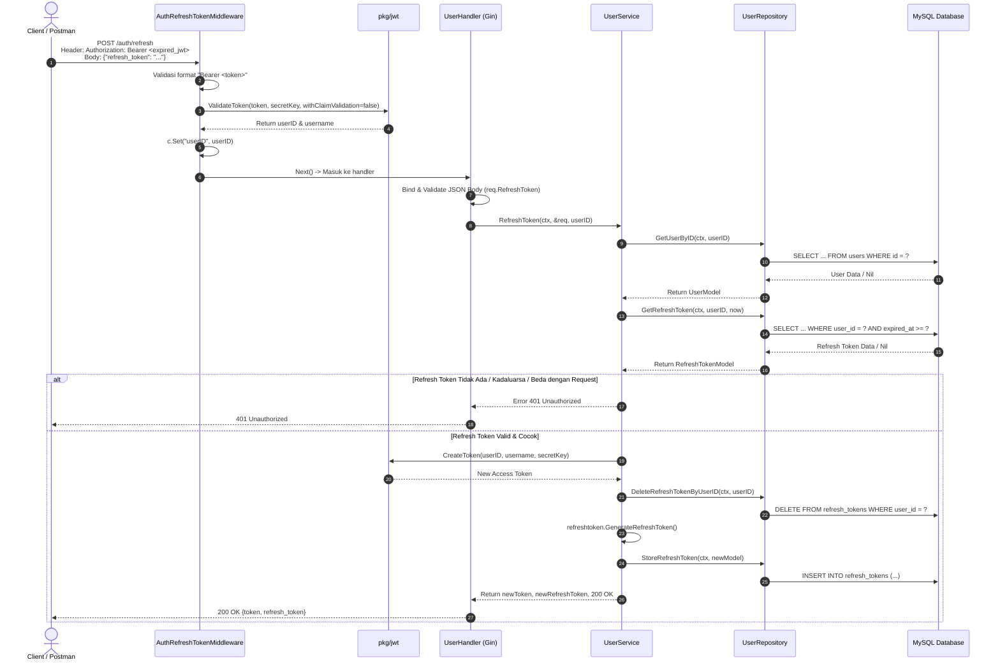

# Catatan Pembelajaran #05: Fitur Refresh Token, Middleware Autentikasi JWT, dan Token Rotation

Dokumentasi ini mencatat rangkuman arsitektur, kode, alur logika, alasan perancangan (*reason & urgensi*), analisis pro-kontra, pendekatan alternatif, serta best practice industri yang dipelajari pada tahap pembuatan fitur **Refresh Token (`POST /auth/refresh`)**, implementasi **Middleware Autentikasi Gin**, dan mekanisme **Refresh Token Rotation** pada project **go-tweets**.

---

## 1. Ringkasan Fitur yang Dibangun

1. **Endpoint `POST /auth/refresh`**:
   - Memperbarui Access Token JWT yang sudah habis masa berlakunya tanpa memaksa pengguna untuk login ulang.
2. **Middleware Autentikasi (`internal/middleware/middleware.go`)**:
   - `AuthMiddleware`: Memvalidasi header Authorization dan memverifikasi token JWT secara ketat (memeriksa masa berlaku `exp`).
   - `AuthRefreshTokenMiddleware`: Memvalidasi header Authorization Bearer token, namun mengabaikan pengecekan waktu `exp` (`WithoutClaimsValidation`) agar kita tetap bisa mengekstrak `userID` dan `username` dari token yang sudah expired.
3. **Mekanisme Refresh Token Rotation**:
   - Token lama dihapus dari database (`DeleteRefreshTokenByUserID`).
   - Token baru di-generate dan disimpan kembali ke tabel `refresh_tokens`.
   - Menghindari *replay attack* jika refresh token sempat disadap pihak ketiga.
4. **Perluasan Repository & Service**:
   - Penambahan `GetUserByID` dan `DeleteRefreshTokenByUserID` pada repository user.
   - Penambahan logika bisnis `RefreshToken` pada service user.

---

## 2. Tabel Analogi Konsep (Golang vs Laravel vs Next.js)

| Konsep di Fitur Ini | Padanan di Laravel | Padanan di Next.js / TypeScript | Fungsi Utama |
| :--- | :--- | :--- | :--- |
| `internal/middleware/middleware.go` | Route Middleware (`app/Http/Middleware`) | Route Middleware (`middleware.ts`) | Mencegat & memvalidasi request sebelum ke handler |
| `jwt.WithoutClaimsValidation()` | `JWTAuth::setToken($t)->getPayload()` (tanpa cek exp) | `jwt.verify(t, k, { ignoreExpiration: true })` | Membaca isi payload/claims JWT yang masa berlakunya sudah habis |
| `internal/dto/user_dto.go` (`RefreshTokenRequest`) | `RefreshTokenRequest` (FormRequest) | `refreshTokenSchema` (Zod) | DTO validasi body request JSON |
| `internal/service/user/refresh_token.go` | Service Class / Action | Server Action / Lib Service | Orkestrasi rotasi token & verifikasi integritas data |
| `DeleteRefreshTokenByUserID` | Eloquent: `$user->tokens()->delete()` | `prisma.refreshToken.deleteMany(...)` | Menghapus refresh token lama agar tidak bisa dipakai ulang |

---

## 3. Alur Data Runtime (Sequence Flow)



---

## 4. Bedah Kode File per File (Code Deep Dive)

### A. Middleware Autentikasi: `internal/middleware/middleware.go`

* **Fungsi & Alasan Dibuat (Reason / The "Why"):**
  - *Masalah nyata:* Kita tidak ingin meletakkan logika ekstraksi token dan verifikasi JWT di dalam setiap controller/handler secara berulang-ulang (*Don't Repeat Yourself / DRY*). Selain itu, untuk refresh token, kita butuh cara aman mengambil identitas user (`userID`) dari token JWT yang sudah expired tanpa memaksa user menyertakan `user_id` manual di body JSON (yang rawan dipalsukan / *IDOR vulnerability*).
  - *Kenapa wajib ada:* Tanpa middleware ini, setiap route privat harus mem-parse header HTTP sendiri. Tanpa middleware refresh token, server tidak tahu siapa pemilik token yang ingin di-refresh secara terpercaya.
  - *Peran di sistem:* Berdiri di gerbang HTTP sebagai satpam yang mengecek format `Authorization: Bearer <token>`, memverifikasi keaslian signature token, dan menyuntikkan `userID` ke dalam context request.
* **Detail Kodingan (How It Works):**
  ```go
  func AuthRefreshTokenMiddleware(secretKey string) gin.HandlerFunc {
      return func(c *gin.Context) {
          header := c.Request.Header.Get("Authorization")
          if !strings.HasPrefix(header, "Bearer ") {
              c.AbortWithStatusJSON(http.StatusUnauthorized, gin.H{"message": "Invalid token format, must be Bearer token"})
              return
          }

          token := strings.TrimPrefix(header, "Bearer ")
          userID, username, err := jwt.ValidateToken(token, secretKey, false)
          if err != nil {
              c.AbortWithStatusJSON(http.StatusUnauthorized, gin.H{"message": err.Error()})
              return
          }

          c.Set("userID", userID)
          c.Set("username", username)
          c.Next()
      }
  }
  ```
* **Cara Baca Kodingannya:**
  - `func AuthRefreshTokenMiddleware(secretKey string) gin.HandlerFunc`: *"Fungsi ini menerima konfigurasi `secretKey`, lalu mengembalikan sebuah closure (fungsi anonim) yang memenuhi tipe `gin.HandlerFunc`"*.
  - `c.Set("userID", userID)`: *"Simpan nilai userID ke dalam map context request Gin saat ini"*.
  - `c.Next()`: *"Lanjutkan eksekusi ke handler berikutnya di rantai pipeline"*.
* **Pros & Cons:**
  - *Pros:* Bersih, modular, controller tidak tahu-menahu soal parsing header HTTP. `WithoutClaimsValidation` memungkinkan identitas user diekstrak tanpa membuka celah pemalsuan signature.
  - *Cons:* Mengharuskan client mengirim 2 hal saat refresh: access token (di header) dan refresh token (di body).
* **Cara Lain (Pendekatan Alternatif):**
  - *Opsi 1 (Single Refresh Token di Body):* Refresh token disimpan di DB berpasangan dengan `user_id`. Client hanya mengirim refresh token di body, lalu backend mencari baris tersebut di DB. (Kelemahan: query pencarian berbasis string token acak tanpa panduan id user).
  - *Opsi 2 (HttpOnly Cookies):* Menyimpan refresh token di cookie `HttpOnly; Secure; SameSite=Strict`, sehingga otomatis terkirim tanpa campur tangan JavaScript di frontend (lebih kebal XSS).
* **Best Practice:**
  - Selalu gunakan `c.AbortWithStatusJSON` saat error di middleware agar rantai handler berikutnya dihentikan seketika (*fail-fast*).
  - Validasi keberadaan prefix `"Bearer "` sebelum melakukan `TrimPrefix`.

---

### B. Validasi Fleksibel JWT: `pkg/jwt/jwt.go`

* **Fungsi & Alasan Dibuat (Reason / The "Why"):**
  - *Masalah nyata:* Library JWT secara default akan langsung membuang token dan mengembalikan error jika klaim `exp` (waktu expired) terlewati. Padahal untuk use case refresh token, token yang dikirim client **justru adalah token yang sudah kadaluarsa**.
  - *Kenapa wajib ada:* Kita butuh fungsi verifikasi yang tetap mengecek integritas tanda tangan digital (agar hacker tidak bisa mengirim token buatan sendiri), namun mentolerir masa kedaluwarsa.
* **Detail Kodingan (How It Works):**
  ```go
  func ValidateToken(tokenStr, secretKey string, withClaimValidation bool) (int64, string, error) {
      // ...
      if withClaimValidation {
          token, err = jwt.ParseWithClaims(tokenStr, claims, func(t *jwt.Token) (interface{}, error) {
              return key, nil
          })
      } else {
          token, err = jwt.ParseWithClaims(tokenStr, claims, func(t *jwt.Token) (interface{}, error) {
              return key, nil
          }, jwt.WithoutClaimsValidation())
      }
      // ...
  ```
* **Pros & Cons:**
  - *Pros:* Satu fungsi menangani dua kebutuhan (route biasa vs route refresh) hanya dengan flag boolean sederhana.
  - *Cons:* Jika developer salah mengoper `false` pada route transaksi sensitif, token expired bisa tembus jika tidak hati-hati.
* **Cara Lain (Pendekatan Alternatif):**
  - Memisahkan menjadi dua fungsi eksplisit: `ValidateAccessToken(tokenStr, secretKey)` dan `ParseExpiredTokenClaims(tokenStr, secretKey)`. Pendekatan ini lebih eksplisit dan mencegah human error.
* **Best Practice:**
  - Selalu periksa `!token.Valid` setelah parsing.
  - Validasi konversi tipe data klaim secara aman (`claims["id"].(float64)` karena JSON meng-encode semua angka sebagai float).

---

### C. Logika Rotasi Token: `internal/service/user/refresh_token.go`

* **Fungsi & Alasan Dibuat (Reason / The "Why"):**
  - *Masalah nyata:* Refresh token berumur panjang (misal 7 hari). Jika refresh token bersifat statis (tidak pernah berubah selama 7 hari), apabila token tersebut dicuri dari localStorage/perangkat user, penyerang memiliki jendela waktu 7 hari penuh untuk terus menyamar sebagai user.
  - *Kenapa wajib ada:* Mekanisme **Refresh Token Rotation (RTR)** membatasi masa hidup token: sekali digunakan, token lama langsung dihancurkan dan diganti token baru.
* **Detail Kodingan (How It Works):**
  ```go
  // 1. Cek refresh token aktif di DB
  refreshTokenExists, err := s.userRepo.GetRefreshToken(ctx, userID, time.Now())
  if refreshTokenExists.RefreshToken != req.RefreshToken {
      return "", "", http.StatusUnauthorized, errors.New("Refresh token is invalid")
  }
  // 2. Buat Access Token JWT baru
  token, err := jwt.CreateToken(userID, userExists.Username, s.cfg.SecretJWT)
  // 3. Hapus refresh token lama (Token Rotation!)
  err = s.userRepo.DeleteRefreshTokenByUserID(ctx, userID)
  // 4. Generate & simpan refresh token baru
  refreshToken, err := refreshtoken.GenerateRefreshToken()
  s.userRepo.StoreRefreshToken(ctx, &model.RefreshTokenModel{...})
  ```
* **Pros & Cons:**
  - *Pros:* Standar keamanan tinggi (sesuai rekomendasi OAuth 2.0 / IETF). Mengurangi risiko pencurian token.
  - *Cons:* Jika terjadi *race condition* (misal frontend mengirim 2 request refresh bersamaan karena tab ganda), salah satu request bisa gagal karena tokennya sudah dirotasi lebih dulu.
* **Cara Lain (Pendekatan Alternatif):**
  - *Grace Period Rotation:* Memberikan waktu tenggang beberapa detik (misal 15-30 detik) di mana token lama masih bisa diterima sekali lagi untuk mengakomodasi request paralel dari browser yang lambat.
  - *Token Blacklisting di Redis:* Menyimpan daftar token yang di-revoke di Redis dengan TTL otomatis daripada database MySQL.
* **Best Practice:**
  - Pastikan operasi `Delete` dan `Store` dilakukan dengan konsistensi data yang baik (misal dibungkus Database Transaction jika diperlukan).

---

### D. Parameter Placeholder SQL: `internal/repository/user/delete_refresh_token.go`

* **Fungsi & Alasan Dibuat (Reason / The "Why"):**
  - *Masalah nyata:* Kita harus menghapus sesi token lama berdasarkan `user_id` secara aman tanpa celah SQL Injection.
  - *Kenapa wajib ada:* Menjadi jembatan layer data persistence untuk mengeksekusi perintah SQL DELETE.
* **Detail Kodingan (How It Works):**
  ```go
  func (r *userRepository) DeleteRefreshTokenByUserID(ctx context.Context, userID int64) error {
      result, err := r.db.ExecContext(ctx, "DELETE FROM refresh_tokens WHERE user_id = ?", userID)
      // ...
  }
  ```
* **Perbaikan Error 1054 ($1 vs ?):**
  - Placeholder `$1` adalah konvensi PostgreSQL.
  - MySQL hanya memahami tanda tanya `?` sebagai placeholder prepared statement.
* **Pros & Cons:**
  - *Pros:* Eksekusi query langsung (*Plain SQL*) memberikan kontrol penuh dan performa maksimal tanpa overhead ORM.
  - *Cons:* Tidak ada type safety compile-time untuk string SQL (error penulisan query baru ketahuan saat runtime).
* **Cara Lain (Pendekatan Alternatif):**
  - Menggunakan ORM seperti GORM (`db.Where("user_id = ?", userID).Delete(&RefreshToken{})`) atau SQL Builder seperti `sqlc` / `squirrel`.
* **Best Practice:**
  - Jangan pernah menggabungkan string SQL secara langsung (`fmt.Sprintf("DELETE ... %d", userID)`) untuk menghindari risiko SQL Injection. Selalu gunakan prepared statement (`?`).

---

## 5. Deep-Dive Konsep Fundamental Go

1. **Context Values (`c.Set` dan `c.GetInt64`)**:
   Context di Gin menyediakan penyimpanan data in-memory lokal per lifecycle HTTP request. Data yang diset di middleware bisa dibaca dengan aman di handler tanpa perlu passing parameter eksplisit.
2. **First-Class Functions & Middleware Closure**:
   Di Go, fungsi adalah *first-class citizen* yang bisa dikembalikan dari fungsi lain. Pola `func AuthMiddleware(secretKey) gin.HandlerFunc` memanfaatkan closure untuk menyuntikkan konfigurasi tanpa membuat global variable.
3. **Prepared Statement & Driver Compatibility**:
   Driver `go-sql-driver/mysql` mengandalkan konvensi MySQL standard placeholder `?`. Penggunaan placeholder yang tepat memastikan parameter di-escape dan di-type-cast secara native oleh database server.
