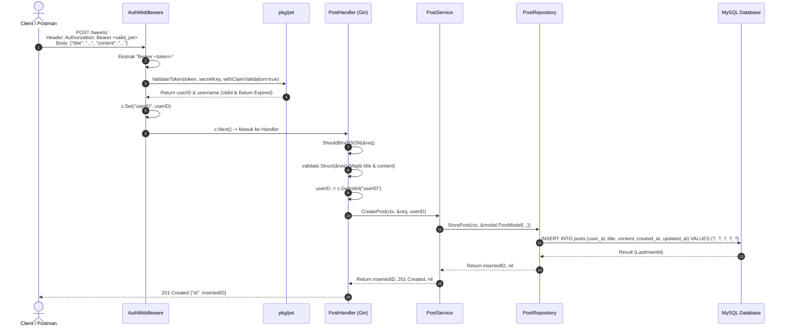

# Catatan Pembelajaran #06: Fitur Create Tweet / Post & Protected Route Middleware

Dokumentasi ini mencatat rangkuman arsitektur, kode, alur logika, alasan perancangan (*reason & the "why"*), analisis trade-off (pro-kontra), pendekatan alternatif, dan best practice industri yang dipelajari pada tahap pembuatan fitur **Membuat Postingan / Tweet Baru (`POST /tweets`)** dengan proteksi **JWT AuthMiddleware** pada project **go-tweets**.

---

## 1. Ringkasan Fitur yang Dibangun

1. **Endpoint `POST /tweets/`**:
   - Memungkinkan pengguna yang sudah login (terautentikasi) untuk mempublikasikan tweet/post baru yang terdiri dari `title` dan `content`.
2. **Protected Route via `middleware.AuthMiddleware`**:
   - Route `/tweets/` dilindungi secara ketat. Pengguna wajib menyertakan token JWT aktif di header `Authorization: Bearer <access_token>`.
   - Token divalidasi secara menyeluruh (termasuk masa berlaku `exp`).
   - Identitas pemilik tweet (`userID`) diambil langsung dari klaim token yang sah, bukan dari payload JSON body, guna mencegah pemalsuan identitas (*IDOR protection*).
3. **Penerapan Clean Architecture Baru (`internal/.../post`)**:
   - DTO: `internal/dto/post_dto.go` (`CreatePostRequest`, `CreatePostResponse`)
   - Entity Model: `internal/model/post_model.go` (`PostModel`)
   - Repository: `internal/repository/post/` (`StorePost`)
   - Service: `internal/service/post/` (`CreatePost`)
   - Handler: `internal/handler/post/` (`CreatePost`, `RouteList`)
   - Wiring di `cmd/main.go`.

---

## 2. Tabel Analogi Konsep (Golang vs Laravel vs Next.js)

| Komponen di Fitur Ini | Padanan di Laravel | Padanan di Next.js / TypeScript | Fungsi Utama |
| :--- | :--- | :--- | :--- |
| `routeAuth.Use(middleware.AuthMiddleware(secretKey))` | Route Group `middleware('auth:sanctum')` | Server Action with `auth()` / Route Handler Guard | Mengunci endpoint agar hanya bisa diakses user login |
| `c.GetInt64("userID")` | `auth()->id()` / `$request->user()->id` | `session.user.id` | Mengambil ID user yang sedang login dari context request |
| `internal/dto/post_dto.go` | `StorePostRequest` (FormRequest) | `createPostSchema` (Zod) | Kontrak validasi input body JSON |
| `internal/service/post/create_post.go` | `CreatePostAction` / `PostService` | Server Action / `postService.create` | Mengatur aturan bisnis sebelum disimpan ke database |
| `internal/repository/post/store_post.go` | `Post::create(...)` / Query Builder | `prisma.post.create(...)` | Mengeksekusi SQL `INSERT INTO posts` |

---

## 3. Alur Data Runtime (Sequence Flow)



---

## 4. Bedah Kode File per File (Code Deep Dive)

### A. DTO Layer: `internal/dto/post_dto.go`

* **Fungsi & Alasan Dibuat (Reason / The "Why"):**
  - *Masalah nyata:* Kita tidak boleh membiarkan klien mengirim data acak atau struktur yang tidak jelas ke server. Di sisi lain, kita tidak ingin mengekspos model database internal secara mentah-mentah ke publik.
  - *Kenapa wajib ada:* DTO menjadi kontrak data yang tegas. Tag `validate:"required"` memastikan bahwa server langsung menolak request jika `title` atau `content` kosong, sebelum query database dijalankan.
* **Detail Kodingan (How It Works):**
  ```go
  type (
      CreatePostRequest struct {
          Title   string `json:"title" validate:"required"`
          Content string `json:"content" validate:"required"`
      }

      CreatePostResponse struct {
          ID int64 `json:"id"`
      }
  )
  ```
* **Pros & Cons:**
  - *Pros:* Terisolasi dari skema database. Jika kolom database bertambah (misal `view_count`, `deleted_at`), request client tidak terganggu.
  - *Cons:* Menambah file dan baris kode baru (boilerplate) dibandingkan langsung menerima generic map.
* **Cara Lain (Pendekatan Alternatif):**
  - Menggunakan satu struct serbaguna untuk Request dan Response (kurang bersih karena response biasanya hanya butuh ID).
* **Best Practice:**
  - Selalu sertakan tag validasi validator v10 (`validate:"required,min=1,max=280"`) untuk mencegah payload kosong atau teks yang terlalu panjang.

---

### B. Handler Layer: `internal/handler/post/create_post.go`

* **Fungsi & Alasan Dibuat (Reason / The "Why"):**
  - *Masalah nyata:* Membaca JSON body, memicu validasi format, dan mengekstrak user ID dari context request.
  - *Kenapa wajib ada:* Handler adalah jembatan HTTP. Ia memisahkan protokol web (Gin HTTP request/response) dari aturan bisnis (Service).
* **Detail Kodingan (How It Works):**
  ```go
  func (h *PostHandler) CreatePost(c *gin.Context) {
      // 1. Bind JSON
      if err := c.ShouldBindJSON(&req); err != nil {
          c.JSON(http.StatusBadRequest, gin.H{"message": err.Error()})
          return
      }

      // 2. Validasi Struct
      if err := h.validate.Struct(&req); err != nil {
          c.JSON(http.StatusBadRequest, gin.H{"message": err.Error()})
          return
      }

      // 3. Ambil userID dari Context (Disuntikkan oleh AuthMiddleware)
      userID := c.GetInt64("userID")
      postID, statusCode, err := h.postService.CreatePost(ctx, &req, userID)
      if err != nil {
          c.JSON(statusCode, gin.H{"message": err.Error()})
          return
      }

      c.JSON(statusCode, dto.CreatePostResponse{ID: postID})
  }
  ```
* **Cara Baca Kodingannya:**
  - `userID := c.GetInt64("userID")`: Mengambil nilai bertipe `int64` dengan key `"userID"` yang sebelumnya diletakkan oleh `AuthMiddleware` saat request melewati satpam autentikasi.
* **Pros & Cons:**
  - *Pros:* Bebas dari celah IDOR (*Insecure Direct Object Reference*), karena klien tidak bisa memalsukan `user_id` orang lain di body JSON.
  - *Cons:* Handler bergantung pada kehadiran middleware sebelumnya. Jika middleware lupa dipasang di route, `userID` akan bernilai `0`.
* **Best Practice:**
  - Pastikan route handler selalu didaftarkan di dalam grup yang telah dipasangi middleware autentikasi.

---

### C. Service Layer: `internal/service/post/create_post.go`

* **Fungsi & Alasan Dibuat (Reason / The "Why"):**
  - *Masalah nyata:* Menentukan logika pembuatan tweet: membuat timestamp `CreatedAt` dan `UpdatedAt` secara sinkron, merangkai model, dan mengoper data ke repository.
  - *Kenapa wajib ada:* Menjaga agar controller/handler tetap ramping (*Thin Controller, Fat Service*) dan menjaga logika bisnis independen dari framework HTTP Gin.
* **Detail Kodingan (How It Works):**
  ```go
  func (s *postService) CreatePost(ctx context.Context, req *dto.CreatePostRequest, userID int64) (int64, int, error) {
      now := time.Now()
      insertedID, err := s.postRepo.StorePost(ctx, &model.PostModel{
          UserID:    userID,
          Title:     req.Title,
          Content:   req.Content,
          CreatedAt: now,
          UpdatedAt: now,
      })
      if err != nil {
          return 0, http.StatusInternalServerError, err
      }

      return insertedID, http.StatusCreated, nil
  }
  ```
* **Pros & Cons:**
  - *Pros:* Sangat mudah di-unit test dengan mock repository tanpa perlu menjalankan server HTTP virtual.
  - *Cons:* Menambah layer pemanggilan fungsi tambahan.
* **Best Practice:**
  - Kembalikan status code HTTP yang semantik (`http.StatusCreated` / 201) untuk operasi pembuatan resource baru.

---

### D. Repository Layer: `internal/repository/post/store_post.go`

* **Fungsi & Alasan Dibuat (Reason / The "Why"):**
  - *Masalah nyata:* Menyimpan record postingan ke tabel database `posts` dan mengembalikan ID baris baru (`AUTO_INCREMENT`).
  - *Kenapa wajib ada:* Mengisolasi sintaks SQL di satu tempat. Jika suatu saat skema database atau database engine berubah, hanya file repository yang disesuaikan.
* **Detail Kodingan (How It Works):**
  ```go
  func (r *postRepository) StorePost(ctx context.Context, model *model.PostModel) (int64, error) {
      query := `INSERT INTO posts (user_id, title, content, created_at, updated_at) VALUES (?, ?, ?, ?, ?)`

      result, err := r.db.ExecContext(ctx, query, model.UserID, model.Title, model.Content, model.CreatedAt, model.UpdatedAt)
      if err != nil {
          return 0, err
      }

      id, err := result.LastInsertId()
      if err != nil {
          return 0, err
      }

      return id, nil
  }
  ```
* **Pelajaran Penting (Return `0, err` vs `0, nil`):**
  - Jika terjadi error pada `r.db.ExecContext`, **wajib `return 0, err`**. Jangan pernah menelan error dengan `return 0, nil` karena akan menyebabkan *silent failure* (klien mengira postingan berhasil dibuat padahal database gagal).
* **Pros & Cons:**
  - *Pros:* Plain SQL cepat, efisien, dan memanfaatkan fitur native MySQL `LastInsertId()`.
  - *Cons:* Query ditulis manual sebagai string, sehingga rentan kesalahan ketik jika tidak hati-hati.
* **Cara Lain (Pendekatan Alternatif):**
  - Menggunakan ORM (GORM / Ent) atau query generator type-safe (`sqlc`).
* **Best Practice:**
  - Gunakan `?` prepared statement untuk mencegah serangan SQL Injection.
  - Periksa error dari `result.LastInsertId()`.

---

## 5. Konsep Fundamental Bahasa Go (*Learning Corner*)

1. **Context Data Passing via Gin (`c.Set` -> `c.GetInt64`)**:
   Context di Gin bertindak sebagai wadah sementara untuk memindahkan data antar middleware dan handler dalam satu alur request HTTP yang sama tanpa menggunakan variabel global.
2. **Method Receiver Pattern**:
   ```go
   func (h *PostHandler) CreatePost(c *gin.Context)
   ```
   Menjadikan fungsi `CreatePost` sebagai method milik objek `PostHandler`, sehingga ia memiliki akses langsung ke dependensi `validate` dan `postService` yang sudah di-inject sebelumnya.
3. **Dependency Injection & Wiring di `main.go`**:
   Semua dependensi dibangun dari bawah ke atas (*bottom-up*):
   `DB` -> `PostRepository` -> `PostService` -> `PostHandler` -> `RouteList`. Ini menjamin tidak ada dependensi tersembunyi (*Inversion of Control*).
