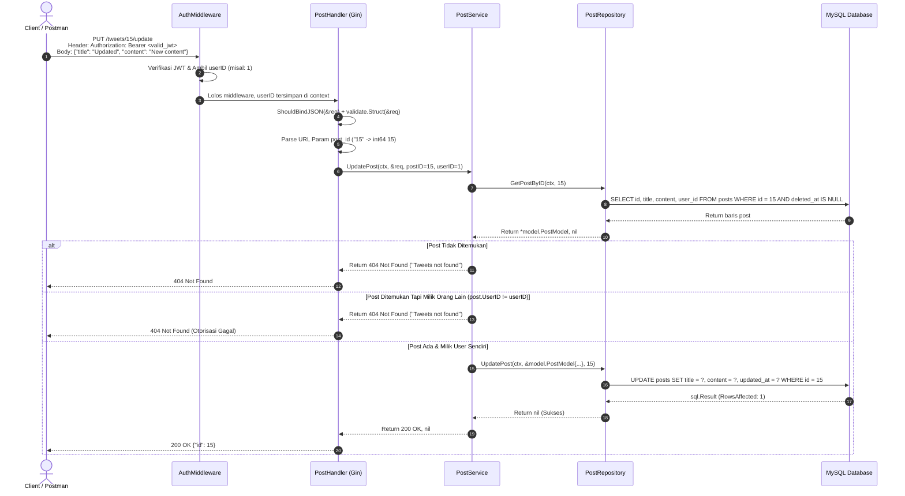

# Catatan Pembelajaran #07: Fitur Update Tweet / Postingan & Ownership Authorization

Dokumentasi ini mencatat rangkuman arsitektur, kode, alur logika, alasan perancangan (*reason & the "why"*), analisis trade-off (pro-kontra), pendekatan alternatif, dan best practice industri yang dipelajari pada tahap pembuatan fitur **Memperbarui Postingan / Tweet (`PUT /tweets/:post_id/update`)** dengan proteksi **Ownership Authorization** pada project **go-tweets**.

---

## 1. Ringkasan Fitur yang Dibangun

1. **Endpoint `PUT /tweets/:post_id/update`**:
   - Memungkinkan pengguna yang sudah login untuk memperbarui `title` dan `content` dari postingan/tweet yang pernah mereka buat.
2. **Ownership Authorization (Pencegahan IDOR)**:
   - Sebelum query update dieksekusi, sistem memeriksa apakah tweet dengan ID tersebut benar-benar ada di database.
   - Sistem memvalidasi apakah `postExists.UserID == userID` (User ID dari token JWT). Jika postingan milik orang lain, akses langsung ditolak (*Access Denied*).
3. **Penyempurnaan & Reusability DTO**:
   - Merefaktor `CreatePostRequest` & `CreatePostResponse` menjadi `CreateOrUpdatePostRequest` & `CreateOrUpdatePostResponse` karena struktur payload untuk Create dan Update sama persis.
4. **Operasi Database Spesifik**:
   - **`QueryRowContext`** pada `GetPostByID` untuk mengambil single row data dengan penanganan khusus `sql.ErrNoRows`.
   - **`ExecContext`** pada `UpdatePost` dengan validasi `RowsAffected()` untuk memastikan data benar-benar berubah di database.

---

## 2. Tabel Analogi Konsep (Golang vs Laravel vs Next.js)

| Komponen di Fitur Ini | Padanan di Laravel | Padanan di Next.js / TypeScript | Fungsi Utama |
| :--- | :--- | :--- | :--- |
| `routeAuth.PUT("/:post_id/update", ...)` | `Route::put('/tweets/{id}', ...)` | Route Handler `PUT` di `app/api/tweets/[id]/route.ts` | Endpoint HTTP untuk pembaruan data |
| `c.Param("post_id")` | `$request->route('id')` | `params.id` di Next.js Dynamic Route | Mengambil parameter path dari URL |
| `CreateOrUpdatePostRequest` | `UpdatePostRequest` (FormRequest) | `updatePostSchema` (Zod Schema) | Validasi payload JSON input |
| `postExists.UserID != userID` | Laravel Policy (`$user->can('update', $post)`) | Guard Check `session.user.id !== post.userId` | Validasi kepemilikan data (Otorisasi) |
| `r.db.GetPostByID` (`QueryRowContext`) | `Post::find($id)` | `prisma.post.findUnique(...)` | Mengambil 1 baris record by ID |
| `r.db.UpdatePost` (`ExecContext`) | `$post->update(...)` / `DB::update(...)` | `prisma.post.update(...)` | Menjalankan mutasi SQL `UPDATE` |

---

## 3. Alur Data Runtime (Sequence Flow)



---

## 4. Bedah Kode File per File (Code Deep Dive)

### A. DTO Layer: `internal/dto/post_dto.go`
* **Apa yang Berubah?**
  Mengganti nama struct `CreatePostRequest` dan `CreatePostResponse` menjadi `CreateOrUpdatePostRequest` dan `CreateOrUpdatePostResponse`.
* **Fungsi & Alasan Dibuat (Reason / The "Why"):**
  - *Masalah nyata:* Payload yang dibutuhkan untuk membuat tweet baru dan mengupdate tweet lama identik: keduanya membutuhkan `title` dan `content` berformat string dan bersifat wajib (`required`).
  - *Kenapa diubah:* Mencegah duplikasi kode (*DRY - Don't Repeat Yourself*). Daripada membuat dua struct kembar yang isinya sama persis, menyatukan DTO membuat pemeliharaan kode lebih ringkas.
* **Detail Kodingan:**
  ```go
  type (
      CreateOrUpdatePostRequest struct {
          Title   string `json:"title" validate:"required"`
          Content string `json:"content" validate:"required"`
      }

      CreateOrUpdatePostResponse struct {
          ID int64 `json:"id"`
      }
  )
  ```
* **Pros & Cons:**
  - *Pros:* Hemat baris kode, perubahan aturan validasi title/content otomatis berlaku untuk Create dan Update.
  - *Cons:* Jika di masa depan operasi Update memperbolehkan *partial update* (misal hanya ubah title tanpa content), struct ini harus dipisah kembali.

---

### B. Repository Layer: `internal/repository/post/`

Pada layer repository, terdapat penambahan kontrak interface di `repository.go` dan dua file implementasi baru:

#### 1. `get_post_by_id.go` (`QueryRowContext`)
* **Fungsi & Alasan Dibuat:**
  Mengambil record postingan berdasarkan ID untuk keperluan pengecekan eksistensi dan validasi kepemilikan sebelum diupdate.
* **Detail Kodingan:**
  ```go
  func (r *postRepository) GetPostByID(ctx context.Context, postID int64) (*model.PostModel, error) {
      query := `SELECT id, title, content, user_id, created_at, updated_at FROM posts WHERE id = ? AND deleted_at IS NULL`

      row := r.db.QueryRowContext(ctx, query, postID)
      var result model.PostModel
      err := row.Scan(&result.ID, &result.Title, &result.Content, &result.UserID, &result.CreatedAt, &result.UpdatedAt)
      if err != nil {
          if err == sql.ErrNoRows {
              return nil, nil // Data memang tidak ada di DB (bukan error sistem)
          }
          return nil, err // Error teknis database
      }

      return &result, nil
  }
  ```
* **Cara Baca Kodingan:**
  - `QueryRowContext`: Memerintahkan DB membaca tepat 1 baris.
  - `row.Scan(...)`: Memetakan kolom hasil SQL ke alamat memori field struct `result`.
  - `if err == sql.ErrNoRows`: Menjinakkan error bawaan driver Go ketika data tidak ditemukan, agar mengembalikan `(nil, nil)` selayaknya `Post::find()` di Laravel atau Prisma.

#### 2. `update_post.go` (`ExecContext`)
* **Fungsi & Alasan Dibuat:**
  Mengeksekusi perintah SQL `UPDATE` untuk mengubah data kolom `title`, `content`, dan `updated_at`.
* **Detail Kodingan:**
  ```go
  func (r *postRepository) UpdatePost(ctx context.Context, model *model.PostModel, postID int64) error {
      query := `UPDATE posts SET title = ?, content = ?, updated_at = ? WHERE id = ?`
      result, err := r.db.ExecContext(ctx, query, model.Title, model.Content, model.UpdatedAt, postID)
      if err != nil {
          return err
      }

      rowAffected, _ := result.RowsAffected()
      if rowAffected == 0 {
          return errors.New("Nothing to update")
      }

      return nil
  }
  ```
* **Cara Baca Kodingan:**
  - `ExecContext`: Digunakan karena operasi `UPDATE` adalah mutasi data (tidak menghasilkan result set baris data).
  - `result.RowsAffected()`: Memverifikasi apakah ada baris tabel yang benar-benar diperbarui.

---

### C. Service Layer: `internal/service/post/update_post.go`

* **Fungsi & Alasan Dibuat (The Core Business Logic & Security Guard):**
  - *Masalah nyata:* Dalam sistem multi-pengguna, bahaya terbesar pada fitur update adalah celah **IDOR (Insecure Direct Object Reference)**, di mana User A bisa mengedit tweet User B hanya dengan menebak/mengganti ID postingan di URL.
  - *Kenapa wajib ada:* Service bertanggung jawab memastikan bahwa hanya pemilik sah postingan yang boleh melakukan perubahan.
* **Detail Kodingan:**
  ```go
  func (s *postService) UpdatePost(ctx context.Context, req *dto.CreateOrUpdatePostRequest, postID, userID int64) (int, error) {
      // 1. Cek apakah tweet ada di database
      postExists, err := s.postRepo.GetPostByID(ctx, postID)
      if err != nil {
          return http.StatusInternalServerError, err
      }

      if postExists == nil {
          return http.StatusNotFound, errors.New("Tweets not found")
      }

      // 2. Ownership Check: Apakah user yang login adalah pemilik tweet?
      if postExists.UserID != userID {
          return http.StatusNotFound, errors.New("Tweets not found")
      }

      // 3. Eksekusi Update ke Database
      err = s.postRepo.UpdatePost(ctx, &model.PostModel{
          Title:     req.Title,
          Content:   req.Content,
          UpdatedAt: time.Now(),
      }, postID)
      if err != nil {
          return http.StatusInternalServerError, err
      }

      return http.StatusOK, nil
  }
  ```
* **Catatan Keamanan (Security Insights):**
  Mengapa jika `postExists.UserID != userID` kita mengembalikan pesan dan status yang sama persis dengan tweet tidak ditemukan (`404 Not Found: Tweets not found`), bukan `403 Forbidden`?
  - *Pola Keamanan (Anti-Enumeration / Information Disclosure Prevention):* Jika dikembalikan `403 Forbidden`, penyerang jadi tahu bahwa postingan ID tersebut **nyata ada di database** (hanya saja bukan milik dia). Dengan me-return `404 Not Found`, penyerang tidak bisa mendeteksi keberadaan ID data milik orang lain.

---

### D. Handler Layer: `internal/handler/post/update_post.go` & `handler.go`

* **Fungsi & Alasan Dibuat:**
  Menerima HTTP request, melakukan unmarshal body JSON, memvalidasi input, mengekstrak URL parameter `:post_id`, dan mengambil `userID` dari JWT context.
* **Detail Kodingan:**
  ```go
  func (h *PostHandler) UpdatePost(c *gin.Context) {
      // ... Bind JSON & Validate Struct ...
      userID := c.GetInt64("userID")
      postIDStr := c.Param("post_id")
      postID, err := strconv.ParseInt(postIDStr, 10, 64)
      if err != nil {
          c.JSON(http.StatusBadRequest, gin.H{"message": "Invalid post ID"})
          return
      }

      statusCode, err := h.postService.UpdatePost(ctx, &req, postID, userID)
      if err != nil {
          c.JSON(statusCode, gin.H{"message": err.Error()})
          return
      }

      c.JSON(statusCode, dto.CreateOrUpdatePostResponse{ID: postID})
  }
  ```
* **Registrasi Route (`handler.go`):**
  ```go
  routeAuth := h.api.Group("/tweets")
  routeAuth.Use(middleware.AuthMiddleware(secretKey))
  routeAuth.POST("/", h.CreatePost)
  routeAuth.PUT("/:post_id/update", h.UpdatePost) // Endpoint baru
  ```

---

## 5. Learning Corner: Konsep Fundamental Golang yang Digunakan

### 1. `ExecContext` vs `QueryRowContext` (Kapan Masing-masing Digunakan?)

Perbedaan mendasar antara `ExecContext` dan `QueryRowContext` terletak pada **tujuan query SQL-nya**: apakah kamu ingin **mengubah data (mutasi)** atau **mengambil data (baca)**.

```
                     ┌──────────────────────────────────────────────┐
                     │          Tipe Operasi Database               │
                     └──────────────────────┬───────────────────────┘
                                            │
               ┌────────────────────────────┴───────────────────────────┐
               ▼                                                        ▼
        AKSI / MUTASI                                           BACA DATA (QUERY)
    (Insert / Update / Delete)                                (SELECT Data dari Tabel)
               │                                                        │
               ▼                                                        ▼
        r.db.ExecContext(...)                                    Butuh berapa baris?
               │                                            ┌───────────┴───────────┐
               │                                            ▼                       ▼
    Kembalian: (sql.Result, error)                     Tepat 1 Baris           Banyak Baris
    - LastInsertId()                                (Single Record)           (List / Array)
    - RowsAffected()                                        │                       │
                                                            ▼                       ▼
                                                r.db.QueryRowContext(...)    r.db.QueryContext(...)
```

| Fitur | `ExecContext` | `QueryRowContext` | `QueryContext` |
| :--- | :--- | :--- | :--- |
| **Kata Kunci** | **Execute** (Jalankan aksi) | **Query Row** (Ambil 1 baris) | **Query** (Ambil banyak baris) |
| **Tujuan** | Menjalankan perintah mutasi tanpa butuh data baris tabel kembali | Mengambil **tepat 1 baris** data unik dari DB | Mengambil kumpulan baris (0 atau banyak baris) |
| **Tipe SQL** | `INSERT`, `UPDATE`, `DELETE`, `CREATE TABLE` | `SELECT ... WHERE id = ? LIMIT 1`, `COUNT(*)` | `SELECT ... WHERE ...` (Timeline feed, list) |
| **Return Value** | `(sql.Result, error)` | `*sql.Row` (tanpa return error langsung) | `(*sql.Rows, error)` |
| **Cara Baca Hasil** | `result.LastInsertId()` atau `result.RowsAffected()` | Wajib dipanggil `.Scan(&var1, &var2, ...)` | Looping dengan `for rows.Next() { rows.Scan(...) }` |

#### Bedah Detail Keduanya di Project Ini:

1. **`ExecContext` (Digunakan di `store_post.go` dan `update_post.go`):**
   - Saat `INSERT` (`store_post.go`): Kita butuh ID auto-increment yang baru di-generate:
     ```go
     result, err := r.db.ExecContext(ctx, query, ...)
     id, _ := result.LastInsertId()
     ```
   - Saat `UPDATE` (`update_post.go`): Kita butuh memastikan apakah ada baris tabel yang benar-benar terupdate:
     ```go
     result, err := r.db.ExecContext(ctx, query, ...)
     rowAffected, _ := result.RowsAffected()
     if rowAffected == 0 {
         return errors.New("Nothing to update")
     }
     ```

2. **`QueryRowContext` (Digunakan di `get_post_by_id.go`):**
   - Method ini tidak me-return `error` secara langsung di fungsinya, melainkan error baru akan ketahuan saat kita memanggil `.Scan(...)`.
   - Driver database secara otomatis mengembalikan koneksi ke pool begitu proses `.Scan(...)` selesai.

---

### 2. Mengapa Ada Pengecekan `sql.ErrNoRows` dan Kenapa `return nil, nil`?

Di file `get_post_by_id.go`:
```go
row := r.db.QueryRowContext(ctx, query, postID)
var result model.PostModel
err := row.Scan(&result.ID, &result.Title, &result.Content, &result.UserID, &result.CreatedAt, &result.UpdatedAt)
if err != nil {
    if err == sql.ErrNoRows {
        return nil, nil
    }
    return nil, err
}

return &result, nil
```

#### A. Kenapa Driver Go Menghasilkan `sql.ErrNoRows`?
Di library bawaan `database/sql`, ketika kamu menjalankan `QueryRowContext` dan ternyata query SQL `SELECT ... WHERE id = ?` tidak menemukan baris data sama sekali (0 rows), pemanggilan `.Scan()` akan menghasilkan error bawaan bernama `sql.ErrNoRows`.

#### B. Kenapa "Data Tidak Ada" Bukan Kerusakan Sistem?
- Data tidak ditemukan (misal user mencari tweet ID `999` yang belum pernah dibuat) adalah **kondisi data yang normal/valid**, bukan kerusakan teknis database seperti server down, query error, atau koneksi timeout.
- Jika kita tidak menjinakkan `sql.ErrNoRows`, repository akan melempar error tersebut ke Service dan Handler, yang berakibat fatal: API akan mengembalikan status **`500 Internal Server Error`** padahal seharusnya **`404 Not Found`**!

#### C. Makna Dua `nil` pada `return nil, nil`:
Signature method repository adalah:
```go
func (r *postRepository) GetPostByID(...) (*model.PostModel, error)
//                                         ^^^^^^^^^^^^^^^^  ^^^^^
//                                            Nilai ke-1    Nilai ke-2
```
Ketika kita me-return `nil, nil`:
1. **Nilai ke-1 (`nil`)**: Objek post bernilai kosong / data memang tidak ada di DB.
2. **Nilai ke-2 (`nil`)**: Tidak ada error teknis / sistem database bekerja normal tanpa kendala.

#### D. Analogi ke Laravel & Next.js / TypeScript:

| Bahasa / Framework | Cara Kerja Query by ID | Hasil Kalau Data Tidak Ada |
| :--- | :--- | :--- |
| **Laravel (Eloquent)** | `Post::find($id)` | Mengembalikan **`null`** (bukan melempar Exception). |
| **Next.js (Prisma)** | `prisma.post.findUnique(...)` | Promise resolve ke **`null`** (tidak throw error). |
| **Golang (`database/sql`)** | `row.Scan(...)` | Melempar error `sql.ErrNoRows`. Karena itu di repo kita ubah jadi `return nil, nil` agar perilakunya sama seperti `find()` di Laravel/Prisma! |

#### E. Bagaimana Service Memanfaatkan `return nil, nil`:
Di layer Service, pengecekannya menjadi sangat rapi dan ekspresif:
```go
post, err := s.postRepo.GetPostByID(ctx, postID)
if err != nil {
    // 1. Ini BENAR-BENAR error teknis DB (Handler return HTTP 500)
    return http.StatusInternalServerError, err
}

if post == nil {
    // 2. Query aman, tapi datanya memang tidak ada di DB (Handler return HTTP 404)
    return http.StatusNotFound, errors.New("Tweets not found")
}

// 3. Post ditemukan! Lanjut ke pengecekan otorisasi kepemilikan (post.UserID == userID)
```

---

### 3. Parsing String ke Integer (`strconv.ParseInt`)
Di framework web seperti Gin, nilai parameter path dari URL (`c.Param("post_id")`) selalu bertipe data `string`. Karena tipe kolom ID di model dan database adalah `int64`, kita wajib mengonversinya secara eksplisit menggunakan `strconv.ParseInt(postIDStr, 10, 64)`.

---

### 4. Aturan Emas & Gotchas (Database Operations)

> [!TIP]
> - **Kapan Pakai `ExecContext`?** $\rightarrow$ Gunakan untuk `INSERT`, `UPDATE`, `DELETE`.
> - **Kapan Pakai `QueryRowContext`?** $\rightarrow$ Gunakan untuk mencari 1 data spesifik (`SELECT ... LIMIT 1` atau `COUNT(*)`). Selalu jinakkan `sql.ErrNoRows` menjadi `return nil, nil`.
> - **Kapan Pakai `QueryContext`?** $\rightarrow$ Gunakan saat mengambil list/kumpulan data banyak baris (misal timeline feed), lalu loop menggunakan `rows.Next()` dan wajib lakukan `defer rows.Close()` untuk mencegah **connection leak**.
> - **Jangan pernah pakai `ExecContext` untuk `SELECT`**, karena `ExecContext` akan membuang semua data baris tabel yang dikembalikan database.

---

## 6. Rekomendasi Perbaikan & Best Practice

1. **HTTP Status Code pada Kegagalan Parse `post_id`**:
   Pada `internal/handler/post/update_post.go`:
   ```go
   postID, err := strconv.ParseInt(postIDStr, 10, 64)
   if err != nil {
       // Rekomendasi: Gunakan http.StatusBadRequest (400)
       c.JSON(http.StatusBadRequest, gin.H{"message": "Invalid post ID format"})
       return
   }
   ```
   *Alasan:* Jika client mengirim `/tweets/abc/update`, kesalahan ada pada sisi client yang mengirimkan format ID tidak valid, sehingga seharusnya menghasilkan `400 Bad Request`, bukan `500 Internal Server Error`.

2. **Konsistensi HTTP Status Code Otorisasi**:
   Pendekatan mengembalikan `404 Not Found` untuk post milik orang lain sangat bagus untuk privasi (anti-enumeration). Namun jika API dirancang untuk dashboard internal/CMS, `403 Forbidden` (`http.StatusForbidden`) lebih standar untuk menunjukkan bahwa user tidak memiliki hak akses (*permission denied*).
