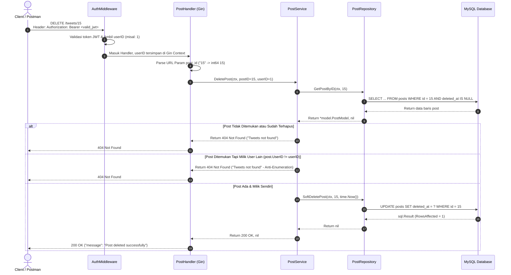

# Catatan Pembelajaran #08: Fitur Soft Delete Tweet & Data Persistence

Dokumentasi ini mencatat rangkuman arsitektur, kode, alur logika, alasan perancangan (*reason & the "why"*), analisis trade-off (pro-kontra), pendekatan alternatif, dan best practice industri yang dipelajari pada tahap pembuatan fitur **Menghapus Postingan / Tweet dengan Mekanisme Soft Delete (`DELETE /tweets/:post_id`)** pada project **go-tweets**.

---

## 1. Ringkasan Fitur yang Dibangun

1. **Konsep Soft Delete (Penghapusan Lunak)**:
   - Data tweet tidak benar-benar dihapus secara fisik dari hard disk (*Hard Delete*), melainkan hanya ditandai dengan mengisi stempel waktu pada kolom `deleted_at` (`UPDATE posts SET deleted_at = ? WHERE id = ?`).
   - Query pembacaan data (seperti `GetPostByID`) secara otomatis mengabaikan data yang sudah dihapus karena memiliki klausa `WHERE deleted_at IS NULL`.
2. **Ownership Authorization & IDOR Prevention**:
   - Sebelum postingan dihapus, sistem memverifikasi bahwa postingan tersebut ada dan `postExists.UserID == userID` (milik user yang sedang login via token JWT).
   - Pengguna lain tidak dapat menghapus tweet yang bukan miliknya.
3. **Penyusunan Kode Multi-Layer**:
   - **Repository**: Method `SoftDeletePost(ctx, postID, now)` menggunakan `r.db.ExecContext` dan memvalidasi `result.RowsAffected()`.
   - **Service**: Method `DeletePost(ctx, postID, userID)` menangani aturan bisnis dan otorisasi.
   - **Handler**: Method `DeletePost(c *gin.Context)` memproses request HTTP, mengambil parameter URL `:post_id`, dan merespons pesan sukses.

---

## 2. Tabel Analogi Konsep (Golang vs Laravel vs Next.js)

| Komponen di Fitur Ini | Padanan di Laravel | Padanan di Next.js / TypeScript | Fungsi Utama |
| :--- | :--- | :--- | :--- |
| Soft Delete (`UPDATE ... SET deleted_at = ?`) | Eloquent `SoftDeletes` trait (`$post->delete()`) | Prisma Soft Delete / `prisma.post.update({ data: { deletedAt: new Date() } })` | Menandai data terhapus tanpa membuang baris fisik |
| Filter `WHERE deleted_at IS NULL` | Laravel Global Scope `SoftDeletingScope` (otomatis aktif) | Prisma Extension query filter `{ deletedAt: null }` | Memastikan data terhapus tidak muncul di query baca |
| `postExists.UserID != userID` | Laravel Policy (`$user->can('delete', $post)`) | Server Action ownership check `session.user.id !== post.userId` | Memvalidasi hak akses penghapusan data |
| `routeAuth.DELETE("/:post_id", ...)` | `Route::delete('/tweets/{id}', ...)` | Route Handler `DELETE` di `app/api/tweets/[id]/route.ts` | Endpoint HTTP untuk operasi hapus |

---

## 3. Alur Data Runtime (Sequence Flow)



---

## 4. Bedah Kode File per File (Code Deep Dive)

### A. Repository Layer: `internal/repository/post/soft_delete_post.go`

* **Fungsi & Alasan Dibuat (Reason / The "Why"):**
  - *Masalah nyata:* Jika kita menggunakan `DELETE FROM posts WHERE id = ?` (*Hard Delete*), data hilang permanen. Jika ada tabel lain seperti `likes`, `retweets`, atau `replies`, terjadi pelanggaran integritas referensial (foreign key error) atau data relasi menjadi yatim (*orphaned data*). Selain itu, untuk kebutuhan audit trail, hukum, atau fitur *"undo/restore"*, data tidak boleh dibuang sembarangan.
  - *Solusi:* Menggunakan Soft Delete dengan meng-update kolom `deleted_at`.
* **Detail Kodingan:**
  ```go
  func (r *postRepository) SoftDeletePost(ctx context.Context, postID int64, now time.Time) error {
      query := `UPDATE posts SET deleted_at = ? WHERE id = ?`

      result, err := r.db.ExecContext(ctx, query, now, postID)
      if err != nil {
          return err
      }

      rowAffected, _ := result.RowsAffected()
      if rowAffected == 0 {
          return errors.New("Nothing to update")
      }

      return nil
  }
  ```
* **Cara Baca Kodingan:**
  - `ExecContext`: Digunakan karena query `UPDATE` adalah operasi aksi mutasi.
  - `now time.Time`: Waktu penghapusan dioper dari luar (service) alih-alih memakai fungsi MySQL `NOW()`, agar konsisten dengan timezone aplikasi dan mempermudah unit testing (dapat dimock).
  - `result.RowsAffected()`: Memastikan bahwa minimal ada satu baris data yang diubah stempel waktunya.

---

### B. Service Layer: `internal/service/post/delete_post.go`

* **Fungsi & Alasan Dibuat:**
  Menjadi benteng aturan bisnis dan keamanan sebelum operasi database dijalankan.
* **Detail Kodingan:**
  ```go
  func (s *postService) DeletePost(ctx context.Context, postID, userID int64) (int, error) {
      // 1. Cek apakah postingan ada & belum dihapus
      postExists, err := s.postRepo.GetPostByID(ctx, postID)
      if err != nil {
          return http.StatusInternalServerError, err
      }

      if postExists == nil {
          return http.StatusNotFound, errors.New("Tweets not found")
      }

      // 2. Cek kepemilikan (Ownership Authorization)
      if postExists.UserID != userID {
          return http.StatusNotFound, errors.New("Tweets not found")
      }

      // 3. Jalankan Soft Delete
      err = s.postRepo.SoftDeletePost(ctx, postID, time.Now())
      if err != nil {
          return http.StatusInternalServerError, err
      }

      return http.StatusOK, nil
  }
  ```
* **Keamanan Anti-IDOR:**
  Sama seperti fitur Update, jika user yang mencoba menghapus bukanlah pemilik tweet (`postExists.UserID != userID`), service mengembalikan `404 Not Found` alih-alih `403 Forbidden` untuk mencegah *Information Disclosure* / *ID Enumeration*.

---

### C. Handler Layer: `internal/handler/post/delete_post.go`

* **Fungsi & Alasan Dibuat:**
  Mengekstrak parameter URL `:post_id`, mengambil identitas `userID` dari JWT context, dan memanggil service layer.
* **Detail Kodingan:**
  ```go
  func (h *PostHandler) DeletePost(c *gin.Context) {
      var (
          ctx       = c.Request.Context()
          userID    = c.GetInt64("userID")
          postIDStr = c.Param("post_id")
      )

      postID, err := strconv.ParseInt(postIDStr, 10, 64)
      if err != nil {
          c.JSON(http.StatusBadRequest, gin.H{"message": "Invalid post ID format"})
          return
      }

      statusCode, err := h.postService.DeletePost(ctx, postID, userID)
      if err != nil {
          c.JSON(statusCode, gin.H{"message": err.Error()})
          return
      }

      c.JSON(statusCode, gin.H{
          "message": "Post deleted successfully",
      })
  }
  ```

---

## 5. Learning Corner: Konsep Fundamental

### 1. Soft Delete vs Hard Delete

| Aspek | Soft Delete (Penghapusan Lunak) | Hard Delete (Penghapusan Fisik) |
| :--- | :--- | :--- |
| **Perintah SQL** | `UPDATE posts SET deleted_at = ? WHERE id = ?` | `DELETE FROM posts WHERE id = ?` |
| **Kondisi Data** | Masih ada di tabel database | Lenyap permanen dari hard disk |
| **Dukungan Recovery** | Sangat mudah (cukup set `deleted_at = NULL`) | Butuh restore backup database |
| **Audit & Kepatuhan** | Bagus untuk rekam jejak & audit trail | Riwayat aktivitas pengguna hilang |
| **Integritas Relasi** | Aman terhadap foreign key `likes`/`comments` | Berpotensi error foreign key constraint |
| **Konsumsi Storage** | Storage terus bertambah seiring waktu | Menghemat ruang hard disk |

### 2. Hubungan Soft Delete dengan Query `GetPostByID`
Perhatikan query di [`internal/repository/post/get_post_by_id.go`](file:///C:/Users/ferry/Documents/coding/GOLANG/go-tweets/internal/repository/post/get_post_by_id.go):
```sql
SELECT id, title, content, user_id, created_at, updated_at 
FROM posts 
WHERE id = ? AND deleted_at IS NULL
```
Klausa `AND deleted_at IS NULL` adalah pasangan mutlak dari Soft Delete. Ketika suatu tweet di-soft delete, `deleted_at` terisi tanggal saat ini. Akibatnya, saat ada yang mencari tweet tersebut by ID, query otomatis menghasilkan 0 baris (`sql.ErrNoRows`), sehingga tweet dianggap tidak pernah ada bagi publik.

---

## 6. Checklist & Rekomendasi (Action Items)

> [!IMPORTANT]
> **Registrasi Route di `internal/handler/post/handler.go` Belum Dilakukan!**  
> File `delete_post.go` sudah dibuat, namun method `h.DeletePost` belum didaftarkan di dalam fungsi `RouteList(secretKey string)`.
> 
> Tambahkan baris berikut di [`internal/handler/post/handler.go`](file:///C:/Users/ferry/Documents/coding/GOLANG/go-tweets/internal/handler/post/handler.go):
> ```go
> routeAuth.DELETE("/:post_id", h.DeletePost)
> ```
> *(Atau jika ingin konsisten dengan update: `routeAuth.DELETE("/:post_id/delete", h.DeletePost)` sesuai standar endpoint yang kamu sukai)*.

> [!TIP]
> **HTTP Status Code pada Parse Error**:  
> Di `internal/handler/post/delete_post.go`, jika `strconv.ParseInt` gagal karena user memasukkan string non-angka (misal `/tweets/abc`), sebaiknya kembalikan **`http.StatusBadRequest` (400)** daripada `http.StatusInternalServerError` (500).
