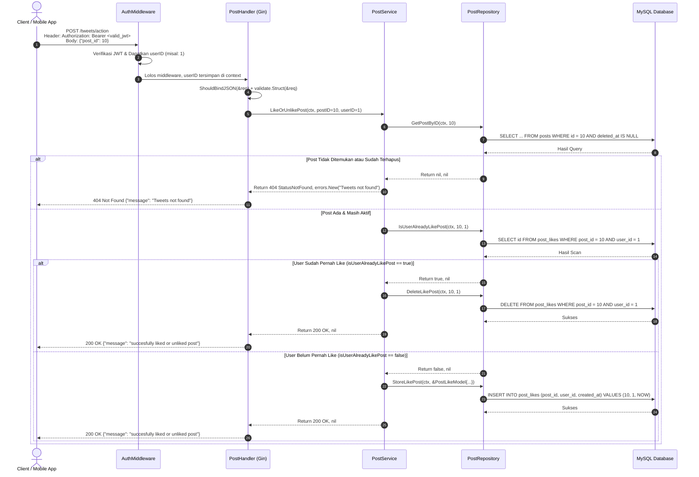

# Catatan Pembelajaran #09: Fitur Like & Unlike Tweet (Toggle Action)

Dokumentasi ini mencatat rangkuman arsitektur, kode, alur logika, alasan perancangan (*reason & the "why"*), analisis trade-off (pro-kontra), pendekatan alternatif, dan best practice industri yang dipelajari pada tahap pembuatan fitur **Suka dan Batal Suka Postingan / Tweet (`POST /tweets/action`)** dengan mekanisme **Toggle Action** pada project **go-tweets**.

---

## 1. Ringkasan Fitur yang Dibangun

1. **Endpoint Tunggal Toggle: `POST /tweets/action`**:
   - Memungkinkan pengguna terautentikasi (login) untuk menyukai (*Like*) atau membatalkan suka (*Unlike*) sebuah postingan hanya dengan satu tombol/endpoint.
2. **Idempotent State Toggle Logic**:
   - Sistem memeriksa database: *Apakah user ini sudah menyukai tweet tersebut?*
   - Jika **Sudah** $\rightarrow$ Hapus data like (`DELETE FROM post_likes WHERE post_id = ? AND user_id = ?`).
   - Jika **Belum** $\rightarrow$ Tambahkan data like (`INSERT INTO post_likes (post_id, user_id, created_at) VALUES (?, ?, ?)`).
3. **Pencegahan Interaksi pada Data Terhapus (Integrity Check)**:
   - Sebelum memeriksa like, sistem memverifikasi apakah postingan tersebut masih aktif via `GetPostByID`. Karena `GetPostByID` menggunakan klausa `deleted_at IS NULL`, postingan yang sudah di-soft delete tidak akan bisa di-like/unlike dan akan merespons `404 Not Found`.
4. **Pelajaran Penting: Konsekuensi `return http.StatusNotFound, nil` vs `errors.New(...)`**:
   - Menghindari bug fatal di mana status HTTP bernilai 404 namun pesan body justru sukses akibat error dikembalikan sebagai `nil`.

---

## 2. Tabel Analogi Konsep (Golang vs Laravel vs Next.js)

| Komponen di Fitur Ini | Padanan di Laravel | Padanan di Next.js / TypeScript | Fungsi Utama |
| :--- | :--- | :--- | :--- |
| Tabel `post_likes` | Pivot Table `like_post` (Many-to-Many) | Junction/Pivot Model `PostLike` di Prisma | Menyimpan relasi user yang menyukai postingan |
| Logika Toggle di Service | `$user->likes()->toggle($postID)` | `if (exists) { delete() } else { create() }` | Membalikkan status suka/tidak suka |
| `IsUserAlreadyLikePost` | `$post->isLikedBy($user)` / `where(...)->exists()` | `prisma.postLike.findFirst(...) !== null` | Pengecekan status suka pengguna |
| DTO `LikeOrUnlikePostRequest` | FormRequest validasi body `post_id` | Zod schema `{ postId: z.number() }` | Validasi input JSON |
| `StoreLikePost` & `DeleteLikePost` | `$post->likes()->attach()` & `detach()` | `prisma.postLike.create()` & `delete()` | Query mutasi data like di tabel pivot |

---

## 3. Alur Data Runtime (Sequence Flow)



---

## 4. Bedah Kode File per File (Code Deep Dive)

### A. DTO & Model Layer: `internal/dto/post_dto.go` & `internal/model/post_model.go`

* **DTO Input Request:**
  ```go
  type LikeOrUnlikePostRequest struct {
      PostID int64 `json:"post_id" validate:"required"`
  }
  ```
  Klien hanya perlu mengirimkan ID dari tweet yang ingin diinteraksikan.

* **Database Model (Pivot Entity):**
  ```go
  type PostLikeModel struct {
      ID        int64
      PostID    int64
      UserID    int64
      CreatedAt time.Time
  }
  ```
  Mewakili skema tabel perantara (*junction/pivot table*) `post_likes` yang menghubungkan relasi Many-to-Many antara pengguna (`users`) dan postingan (`posts`).

---

### B. Repository Layer: `internal/repository/post/`

Terdapat 3 method yang dibuat untuk melayani fitur like ini:

#### 1. `is_user_already_like_post.go`
* **Detail Kodingan:**
  ```go
  func (r *postRepository) IsUserAlreadyLikePost(ctx context.Context, postID, userID int64) (bool, error) {
      query := `SELECT id FROM post_likes WHERE post_id = ? AND user_id = ?`
      row := r.db.QueryRowContext(ctx, query, postID, userID)
      var id int64
      err := row.Scan(&id)
      if err != nil {
          if err == sql.ErrNoRows {
              return false, nil // Data belum ada -> belum pernah like
          }
          return false, err // Error teknis database
      }

      return true, nil // Data ditemukan -> sudah like
  }
  ```
* **Cara Kerja:**
  Menggunakan `QueryRowContext` untuk mencari 1 baris. Jika `sql.ErrNoRows`, fungsi mengembalikan `false, nil` (belum like). Jika `id` berhasil di-scan, mengembalikan `true, nil` (sudah like).

#### 2. `store_like_post.go`
* **Detail Kodingan:**
  ```go
  func (r *postRepository) StoreLikePost(ctx context.Context, model *model.PostLikeModel) error {
      query := `INSERT INTO post_likes (post_id, user_id, created_at) VALUES (?, ?, ?)`
      _, err := r.db.ExecContext(ctx, query, model.PostID, model.UserID, model.CreatedAt)
      return err
  }
  ```

#### 3. `delete_like_post.go`
* **Detail Kodingan:**
  ```go
  func (r *postRepository) DeleteLikePost(ctx context.Context, postID, userID int64) error {
      query := `DELETE FROM post_likes WHERE post_id = ? AND user_id = ?`
      _, err := r.db.ExecContext(ctx, query, postID, userID)
      return err
  }
  ```

---

### C. Service Layer: `internal/service/post/like_or_unlike_post.go`

* **Detail Kodingan:**
  ```go
  func (s *postService) LikeOrUnlikePost(ctx context.Context, postID, userID int64) (int, error) {
      // 1. Cek apakah tweet ada & belum dihapus
      postExists, err := s.postRepo.GetPostByID(ctx, postID)
      if err != nil {
          return http.StatusInternalServerError, err
      }

      if postExists == nil {
          return http.StatusNotFound, errors.New("Tweets not found")
      }

      // 2. Cek status suka saat ini
      isUserAlreadyLikePost, err := s.postRepo.IsUserAlreadyLikePost(ctx, postID, userID)
      if err != nil {
          return http.StatusInternalServerError, err
      }

      // 3. Logika Pembalikan (Toggle)
      if isUserAlreadyLikePost {
          // Batal Suka (Unlike)
          err := s.postRepo.DeleteLikePost(ctx, postID, userID)
          if err != nil {
              return http.StatusInternalServerError, err
          }
      } else {
          // Beri Suka (Like)
          now := time.Now()
          err := s.postRepo.StoreLikePost(ctx, &model.PostLikeModel{
              PostID:    postID,
              UserID:    userID,
              CreatedAt: now,
          })
          if err != nil {
              return http.StatusInternalServerError, err
          }
      }

      return http.StatusOK, nil
  }
  ```

---

### D. Handler Layer: `internal/handler/post/like_or_unlike_post.go`

* **Detail Kodingan:**
  ```go
  func (h *PostHandler) LikeOrUnlikePost(c *gin.Context) {
      var (
          ctx = c.Request.Context()
          req dto.LikeOrUnlikePostRequest
      )

      if err := c.ShouldBindJSON(&req); err != nil {
          c.JSON(http.StatusBadRequest, gin.H{"message": err.Error()})
          return
      }

      if err := h.validate.Struct(&req); err != nil {
          c.JSON(http.StatusBadRequest, gin.H{"message": err.Error()})
          return
      }

      userID := c.GetInt64("userID")
      statusCode, err := h.postService.LikeOrUnlikePost(ctx, req.PostID, userID)
      if err != nil {
          c.JSON(statusCode, gin.H{
              "message": err.Error(),
          })
          return
      }

      c.JSON(statusCode, gin.H{
          "message": "succesfully liked or unliked post",
      })
  }
  ```

---

## 5. Learning Corner: Pelajaran Penting & Analisis Bug

### Pelajaran Emas: Mengapa `return http.StatusNotFound, nil` Mengacaukan Respons?

Pada sesi pengembangan awal, terjadi keanehan respons:
> *Status code 404 Not Found, tetapi message-nya "succesfully liked or unliked post".*

#### Mengapa Hal Tersebut Bisa Terjadi?
Perhatikan kontrak pengecekan error di Golang:
```go
statusCode, err := h.postService.LikeOrUnlikePost(ctx, req.PostID, userID)
if err != nil {
    c.JSON(statusCode, gin.H{"message": err.Error()})
    return
}

c.JSON(statusCode, gin.H{"message": "succesfully liked or unliked post"})
```

Ketika service menulis:
```go
if postExists == nil {
    return http.StatusNotFound, nil // Mengembalikan nil pada parameter error
}
```
1. Handler menerima `err == nil`.
2. Bagi Go, `err == nil` **berarti tidak ada masalah sama sekali (sukses)**!
3. Blok `if err != nil` dilewati, dan handler lanjut mengeksekusi baris terakhir yang mengirimkan pesan sukses `"succesfully liked or unliked post"`, namun membawa status code `404` yang dioper oleh service.

> [!CAUTION]
> **Aturan Emas Explicit Error Handling di Go**:  
> Jika sebuah fungsi mengembalikan status kegagalan (misalnya `400`, `401`, `403`, `404`, atau `500`), **WAJIB** sertakan objek error non-nil (misal: `errors.New("...")` atau custom error), jangan pernah mengembalikan `nil` pada posisi `error` jika operasi dianggap gagal!

---

## 6. Analisis Trade-off (Pros & Cons) Endpoint Toggle

| Pendekatan | Kelebihan (Pros) | Kekurangan (Cons) |
| :--- | :--- | :--- |
| **Single Endpoint Toggle (`POST /tweets/action`)** *(Pendekatan Saat Ini)* | Sangat simpel bagi UI/frontend; cukup tembak 1 endpoint setiap user mengklik tombol Love. | Jika terjadi spam klik (*rapid double clicking*), berisiko terjadi race condition toggle bolak-balik tanpa disengaja. |
| **Dua Endpoint Eksplisit (`POST /tweets/:id/like` & `DELETE /tweets/:id/like`)** | Bersifat strictly idempotent. Mengirim `POST` 10 kali hasilnya tetap like; mengirim `DELETE` 10 kali hasilnya tetap unlike. | Frontend harus melacak state lokal secara ketat sebelum menentukan endpoint mana yang harus dipanggil. |

### Rekomendasi Tambahan (Best Practice di Database)
Untuk mencegah kemungkinan data like ganda akibat koneksi lambat atau double klik, pastikan tabel `post_likes` memiliki **Unique Constraint**:
```sql
ALTER TABLE post_likes ADD CONSTRAINT unique_user_post_like UNIQUE (post_id, user_id);
```
Dengan begitu, satu user secara fisik database tidak akan pernah bisa menyukai postingan yang sama lebih dari satu kali.
