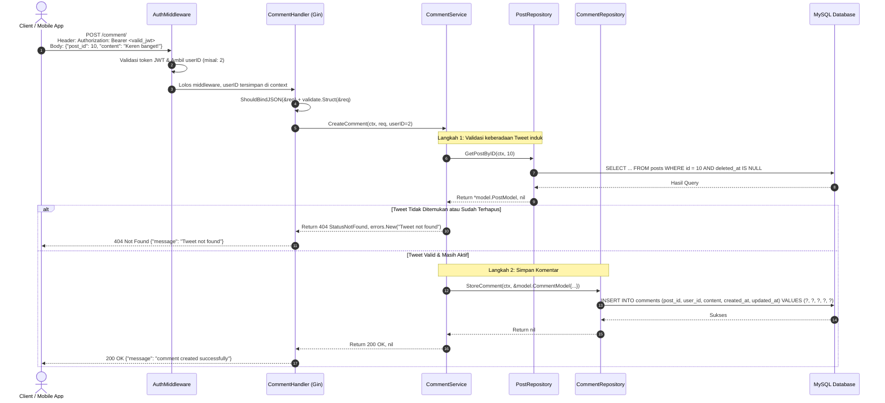

# Catatan Pembelajaran #10: Modul Komentar & Cross-Repository Dependency Injection

Dokumentasi ini mencatat rangkuman arsitektur, kode, alur logika, alasan perancangan (*reason & the "why"*), analisis trade-off (pro-kontra), pendekatan alternatif, dan best practice industri yang dipelajari pada tahap pembuatan fitur **Membuat Komentar pada Tweet (`POST /comment/`)** dengan pola **Cross-Repository Dependency Injection** pada project **go-tweets**.

---

## 1. Ringkasan Fitur yang Dibangun

1. **Entitas & Modul Baru (`internal/.../comment`)**:
   - Membangun seluruh arsitektur baru khusus untuk komentar: DTO, Model, Repository, Service, dan Handler.
2. **Endpoint Protected: `POST /comment/`**:
   - Memungkinkan pengguna yang sudah login (terproteksi JWT `AuthMiddleware`) untuk mengirimkan komentar pada tweet tertentu.
   - Menerima payload JSON: `post_id` dan `content`.
3. **Cross-Repository Dependency Injection**:
   - `CommentService` membutuhkan akses ke dua domain data sekaligus:
     - `commentRepo`: untuk menyimpan baris komentar baru ke tabel `comments`.
     - `postRepo`: untuk memeriksa apakah postingan/tweet target benar-benar ada dan belum di-soft delete.
4. **Pencegahan Orphaned Records & Foreign Key Error**:
   - Validasi eksistensi tweet dilakukan secara proaktif di layer Service. Jika tweet tidak ada atau sudah terhapus, API segera mengembalikan `404 Not Found` sebelum query `INSERT INTO comments` dijalankan.

---

## 2. Tabel Analogi Konsep (Golang vs Laravel vs Next.js)

| Komponen di Fitur Ini | Padanan di Laravel | Padanan di Next.js / TypeScript | Fungsi Utama |
| :--- | :--- | :--- | :--- |
| Tabel & Model `comments` | Eloquent Model `Comment` (Relasi `$post->comments()`) | Prisma Model `Comment` (Relasi One-to-Many) | Skema penyimpanan komentar tweet |
| Cross-Repository Injection | Service/Action meng-inject `CommentRepository` & `PostRepository` | Server Action mengimpor lib `comment` & `post` | Koordinasi data lintas entitas dalam satu aturan bisnis |
| `StoreCommentRequest` | `StoreCommentRequest` (FormRequest) | `createCommentSchema` (Zod Schema) | Validasi body JSON (`post_id`, `content`) |
| Validasi Eksistensi Tweet | `Rule::exists('posts', 'id')->whereNull('deleted_at')` | `await prisma.post.findUniqueOrThrow(...)` | Mencegah komentar pada tweet yang tidak valid/terhapus |
| `routeAuth.POST("/", ...)` | `Route::post('/comments', ...)` | Route Handler `POST` di `app/api/comments/route.ts` | Endpoint HTTP untuk publikasi komentar |

---

## 3. Alur Data Runtime (Sequence Flow)



---

## 4. Bedah Kode File per File (Code Deep Dive)

### A. DTO & Model Layer: `internal/dto/comment_dto.go` & `internal/model/comment_model.go`

* **DTO Request Body:**
  ```go
  type (
      StoreCommentRequest struct {
          PostID  int64  `json:"post_id" validate:"required"`
          Content string `json:"content" validate:"required"`
      }
  )
  ```
  Menjamin bahwa client wajib menyertakan target tweet (`post_id`) dan isi pesan (`content`).

* **Entity Model:**
  ```go
  type (
      CommentModel struct {
          ID        int64
          PostID    int64
          UserID    int64
          Content   string
          CreatedAt time.Time
          UpdatedAt time.Time
      }
  )
  ```

---

### B. Repository Layer: `internal/repository/comment/`

* **Kontrak Interface & Implementasi Constructor:**
  ```go
  type CommentRepository interface {
      StoreComment(ctx context.Context, model *model.CommentModel) error
  }

  type commentRepository struct {
      db *sql.DB
  }

  func NewCommentRepository(db *sql.DB) CommentRepository {
      return &commentRepository{db: db}
  }
  ```

* **Query Mutasi (`store_comment.go`):**
  ```go
  func (r *commentRepository) StoreComment(ctx context.Context, model *model.CommentModel) error {
      query := `INSERT INTO comments (post_id, user_id, content, created_at, updated_at) VALUES (?, ?, ?, ?, ?)`
      _, err := r.db.ExecContext(ctx, query, model.PostID, model.UserID, model.Content, model.CreatedAt, model.UpdatedAt)
      return err
  }
  ```
  Menggunakan `ExecContext` karena ini adalah operasi aksi `INSERT` mutasi data.

---

### C. Service Layer: `internal/service/comment/` (Pola Cross-Repository Injection)

Inilah inti arsitektur dari modul komentar ini:

* **Struktur Struct Service (`service.go`):**
  ```go
  type commentService struct {
      cfg         *config.Config
      commentRepo comment.CommentRepository
      postRepo    post.PostRepository // <-- Injeksi Repository dari domain Post!
  }

  func NewCommentService(cfg *config.Config, commentRepo comment.CommentRepository, postRepo post.PostRepository) CommentService {
      return &commentService{
          cfg:         cfg,
          commentRepo: commentRepo,
          postRepo:    postRepo,
      }
  }
  ```

* **Logika Bisnis Pembuatan Komentar (`create_comment.go`):**
  ```go
  func (s *commentService) CreateComment(ctx context.Context, req *dto.StoreCommentRequest, userID int64) (int, error) {
      // 1. Cek apakah tweet target ada & aktif
      postExists, err := s.postRepo.GetPostByID(ctx, req.PostID)
      if err != nil {
          return http.StatusInternalServerError, err
      }

      if postExists == nil {
          return http.StatusNotFound, errors.New("Tweet not found")
      }

      // 2. Simpan komentar ke tabel comments
      now := time.Now()
      err = s.commentRepo.StoreComment(ctx, &model.CommentModel{
          PostID:    req.PostID,
          UserID:    userID,
          Content:   req.Content,
          CreatedAt: now,
          UpdatedAt: now,
      })
      if err != nil {
          return http.StatusInternalServerError, err
      }

      return http.StatusOK, nil
  }
  ```

---

### D. Handler & Wiring: `internal/handler/comment/` & `cmd/main.go`

* **Wiring Dependensi di `cmd/main.go`:**
  ```go
  postRepo := postRepo.NewPostRepository(db)
  commentRepo := commentRepo.NewCommentRepository(db)

  // commentService menerima postRepo untuk validasi tweet
  commentService := commentService.NewCommentService(cfg, commentRepo, postRepo)
  commentHandler := commentHandler.NewCommentHandler(r, validate, commentService)

  commentHandler.RouteList(cfg.SecretJWT)
  ```

* **Routing Protected (`handler.go`):**
  ```go
  func (h *CommentHandler) RouteList(secretKey string) {
      routeAuth := h.api.Group("/comment")
      routeAuth.Use(middleware.AuthMiddleware(secretKey))
      routeAuth.POST("/", h.CreateComment)
  }
  ```

---

## 5. Learning Corner: Konsep Fundamental Arsitektur

### 1. Mengapa Service Boleh Meng-inject Lebih dari Satu Repository?
Dalam Clean Architecture / Domain-Driven Design (DDD), **Repository terikat pada satu Aggregate/Tabel**, tetapi **Service terikat pada Use Case (Kebutuhan Bisnis)**.

Kebutuhan bisnis "Membuat Komentar" memiliki syarat: *"Sebuah komentar hanya boleh dibuat jika tweet yang bersangkutan nyata dan belum dihapus"*.
Oleh karena itu, `CommentService` bertindak sebagai konduktor/orkestrator yang memanggil:
1. `postRepo.GetPostByID(...)` untuk memverifikasi entitas tweet.
2. `commentRepo.StoreComment(...)` untuk menyimpan entitas komentar.

### 2. Kenapa Harus Cek `GetPostByID` Kalau di Database Sudah Ada Foreign Key?
Kamu mungkin bertanya: *"Di database kan ada foreign key `FOREIGN KEY (post_id) REFERENCES posts(id)`, kenapa harus repot cek `GetPostByID` di kode?"*

Ada dua alasan krusial:
1. **Pemisahan Respons HTTP (404 vs 500)**:
   - Jika kita langsung `INSERT` ke database dengan `post_id` asal-asalan, MySQL akan melempar error `Error 1452: Cannot add or update a child row: a foreign key constraint fails`.
   - Di layer handler, ini akan dianggap sebagai database error teknis dan dikembalikan sebagai **`500 Internal Server Error`**. Padahal kesalahan murni karena client memasukkan tweet ID yang tidak ada (**`404 Not Found`**).
2. **Menghormati Soft Delete**:
   - Foreign key di MySQL hanya memeriksa apakah baris fisik `id` ada di tabel `posts`. MySQL tidak peduli apakah kolom `deleted_at` sudah terisi atau belum!
   - Hanya fungsi `GetPostByID` milik kita yang tahu bahwa tweet dengan `deleted_at IS NOT NULL` sudah mati dan tidak boleh dikomentari lagi.

---

## 6. Rekomendasi Industri & Catatan Perbaikan

1. **HTTP Status Code Pembuatan Data (201 Created vs 200 OK)**:
   Pada `store_comment.go` dan `create_comment.go`:
   Saat berhasil membuat entitas baru di database, standar REST API merekomendasikan status **`201 Created`** (`http.StatusCreated`) ketimbang `200 OK`.
2. **Konvensi Penamaan URL Endpoint**:
   Saat ini endpoint didaftarkan sebagai `POST /comment/` (singular). Standar REST API modern umumnya menggunakan bentuk plural (jamak) agar seragam dengan endpoint lainnya:
   - `/tweets/` (plural) $\rightarrow$ `/comments/` (plural).
3. **Mengembalikan ID Komentar Baru**:
   Di `store_comment.go`, kita bisa memanfaatkan `result.LastInsertId()` dan mengembalikannya ke client (misal: `{"message": "...", "id": commentID}`) agar frontend bisa langsung menautkan komentar yang baru dibuat tanpa harus refresh seluruh halaman.
