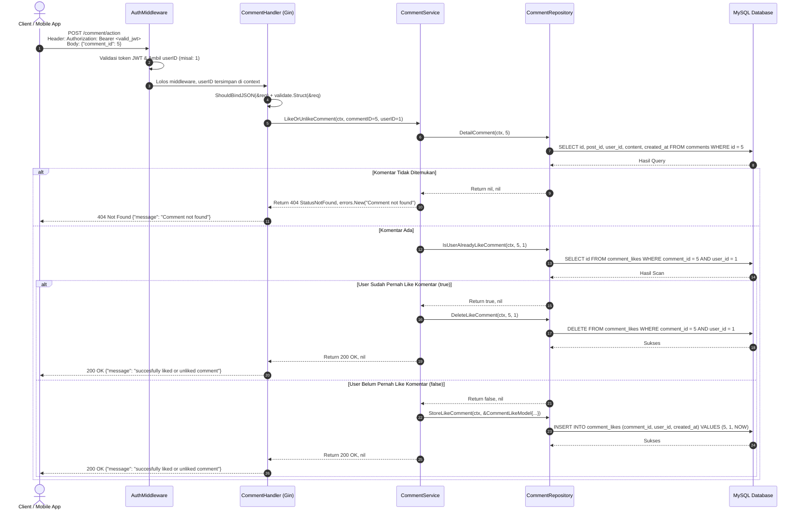

# Catatan Pembelajaran #11: Fitur Like & Unlike Komentar (Toggle Action)

Dokumentasi ini mencatat rangkuman arsitektur, kode, alur logika, alasan perancangan (*reason & the "why"*), analisis trade-off (pro-kontra), pendekatan alternatif, dan best practice industri yang dipelajari pada tahap pembuatan fitur **Suka dan Batal Suka Komentar (`POST /comment/action`)** dengan mekanisme **Toggle Action** pada project **go-tweets**.

---

## 1. Ringkasan Fitur yang Dibangun

1. **Endpoint Protected: `POST /comment/action`**:
   - Memungkinkan pengguna yang sudah login (terproteksi JWT `AuthMiddleware`) untuk menyukai (*Like*) atau membatalkan suka (*Unlike*) sebuah komentar tertentu.
   - Menerima payload JSON: `comment_id`.
2. **Idempotent Toggle Mechanism**:
   - Sistem memeriksa database: *Apakah user yang sedang login sudah menyukai komentar ini?*
   - Jika **Sudah** $\rightarrow$ Hapus data like (`DELETE FROM comment_likes WHERE comment_id = ? AND user_id = ?`).
   - Jika **Belum** $\rightarrow$ Tambahkan data like (`INSERT INTO comment_likes (comment_id, user_id, created_at) VALUES (?, ?, ?)`).
3. **Pengecekan Eksistensi Komentar (`DetailComment`)**:
   - Sebelum interaksi like diproses, sistem memeriksa apakah komentar dengan `comment_id` tersebut nyata ada di database.
   - Jika komentar tidak ditemukan, sistem merespons **`404 Not Found: Comment not found`**.
4. **Penerapan Kaidah Emas Error Handling**:
   - Mengembalikan `errors.New("Comment not found")` bersamaan dengan `http.StatusNotFound` (bukan mengembalikan `nil`), sehingga handler dapat mendeteksi kegagalan dengan benar.

---

## 2. Tabel Analogi Konsep (Golang vs Laravel vs Next.js)

| Komponen di Fitur Ini | Padanan di Laravel | Padanan di Next.js / TypeScript | Fungsi Utama |
| :--- | :--- | :--- | :--- |
| Tabel `comment_likes` | Pivot Table `comment_user` (Many-to-Many) | Junction Table `CommentLike` di Prisma | Menyimpan relasi user yang menyukai komentar |
| Logika Toggle di Service | `$user->likedComments()->toggle($commentId)` | Check existing -> Prisma `delete` / `create` | Membalikkan status suka/tidak suka |
| `DetailComment` | `Comment::find($id)` | `prisma.comment.findUnique(...)` | Mengambil 1 data komentar by ID |
| `IsUserAlreadyLikeComment` | `$comment->isLikedBy($user)` | `prisma.commentLike.findFirst(...) !== null` | Memeriksa apakah user sudah like |
| `LikeOrUnlikeCommentRequest` | FormRequest validasi body `comment_id` | Zod schema `{ commentId: z.number() }` | Kontrak validasi input JSON |

---

## 3. Alur Data Runtime (Sequence Flow)



---

## 4. Bedah Kode File per File (Code Deep Dive)

### A. DTO & Model Layer: `internal/dto/comment_dto.go` & `internal/model/comment_model.go`

* **DTO Request Body:**
  ```go
  type (
      LikeOrUnlikeCommentRequest struct {
          CommentID int64 `json:"comment_id" validate:"required"`
      }
  )
  ```
  Menjamin client mengirimkan ID komentar target yang valid dan tidak kosong.

* **Database Model (Pivot Entity):**
  ```go
  type (
      CommentLikeModel struct {
          ID        int64
          CommentID int64
          UserID    int64
          CreatedAt time.Time
      }
  )
  ```

---

### B. Repository Layer: `internal/repository/comment/`

Terdapat 4 method penting yang ditambahkan pada repository komentar:

#### 1. `detail_comment.go` (`QueryRowContext`)
* **Detail Kodingan:**
  ```go
  func (r *commentRepository) DetailComment(ctx context.Context, commentID int64) (*model.CommentModel, error) {
      query := `SELECT id, post_id, user_id, content, created_at FROM comments WHERE id = ?`
      row := r.db.QueryRowContext(ctx, query, commentID)
      var result model.CommentModel
      err := row.Scan(&result.ID, &result.PostID, &result.UserID, &result.Content, &result.CreatedAt)
      if err != nil {
          if err == sql.ErrNoRows {
              return nil, nil // Data tidak ada (bukan error teknis)
          }
          return nil, err
      }

      return &result, nil
  }
  ```
* **Kaidah Idiomatis Go:** Menggunakan `QueryRowContext` dan menjinakkan `sql.ErrNoRows` menjadi `(nil, nil)` agar tidak menimbulkan respons error 500 palsu di level handler.

#### 2. `is_user_already_like_comment.go`
* **Detail Kodingan:**
  ```go
  func (r *commentRepository) IsUserAlreadyLikeComment(ctx context.Context, commentID, userID int64) (bool, error) {
      query := `SELECT id FROM comment_likes WHERE comment_id = ? AND user_id = ?`
      row := r.db.QueryRowContext(ctx, query, commentID, userID)
      var id int64
      err := row.Scan(&id)
      if err != nil {
          if err == sql.ErrNoRows {
              return false, nil // Belum like
          }
          return false, err
      }
      return true, nil // Sudah like
  }
  ```

#### 3. `store_like_comment.go` & `delete_like_comment.go`
* Menggunakan `ExecContext` untuk mengeksekusi aksi mutasi `INSERT` dan `DELETE`.

---

### C. Service Layer: `internal/service/comment/like_or_unlike_comment.go`

* **Detail Kodingan:**
  ```go
  func (s *commentService) LikeOrUnlikeComment(ctx context.Context, commentID, userID int64) (int, error) {
      // 1. Cek apakah komentar ada di database
      commentExists, err := s.commentRepo.DetailComment(ctx, commentID)
      if err != nil {
          return http.StatusInternalServerError, err
      }
      if commentExists == nil {
          return http.StatusNotFound, errors.New("Comment not found")
      }

      // 2. Cek status suka pengguna saat ini
      isUserAlreadyLikeComment, err := s.commentRepo.IsUserAlreadyLikeComment(ctx, commentID, userID)
      if err != nil {
          return http.StatusInternalServerError, err
      }

      // 3. Logika Pembalikan (Toggle)
      if isUserAlreadyLikeComment {
          // Batal Suka
          err := s.commentRepo.DeleteLikeComment(ctx, commentID, userID)
          if err != nil {
              return http.StatusInternalServerError, err
          }
      } else {
          // Beri Suka
          now := time.Now()
          err := s.commentRepo.StoreLikeComment(ctx, &model.CommentLikeModel{
              CommentID: commentID,
              UserID:    userID,
              CreatedAt: now,
          })
          if err != nil {
              return http.StatusInternalServerError, err
          }
      }

      return http.StatusOK, nil
  }
  ```

---

### D. Handler Layer: `internal/handler/comment/like_or_unlike_comment.go` & `handler.go`

* **Pendaftaran Route (`handler.go`):**
  ```go
  routeAuth := h.api.Group("/comment")
  routeAuth.Use(middleware.AuthMiddleware(secretKey))
  routeAuth.POST("/", h.CreateComment)
  routeAuth.POST("/action", h.LikeOrUnlikeComment) // Endpoint baru
  ```

* **Handler Implementasi (`like_or_unlike_comment.go`):**
  Menerima request, mem-bind JSON ke `LikeOrUnlikeCommentRequest`, memanggil service, dan merespons:
  ```json
  // Status: 200 OK
  {
    "message": "succesfully liked or unliked comment"
  }
  ```

---

## 5. Learning Corner: Konsep Fundamental & Pelajaran Emas

### 💡 Pelajaran Emas & Penerapan Disiplin Error Handling
Perhatikan baris ke 17-19 pada `internal/service/comment/like_or_unlike_comment.go`:
```go
if commentExists == nil {
    return http.StatusNotFound, errors.New("Comment not found")
}
```
Dibandingkan dengan sesi sebelumnya di mana `return http.StatusNotFound, nil` sempat membuat handler mengira proses sukses (sehingga mengirim status 404 tapi pesannya sukses), di fitur ini kamu **sudah menerapkan rumus paten**:
> *Setiap kali mengembalikan status error/gagal (non-2xx), WAJIB menyertakan objek error non-nil seperti `errors.New(...)`!*

Hasilnya, handler langsung memotong alur dengan benar dan menampilkan respons:
```json
// Status: 404 Not Found
{
  "message": "Comment not found"
}
```

---

### 🏛️ Analisis Arsitektur: Tabel Terpisah vs Polymorphic Table

Kamu mungkin bertanya: *"Kenapa kita membuat tabel `post_likes` dan `comment_likes` terpisah, kenapa tidak disatukan jadi 1 tabel `likes` saja?"*

| Pendekatan | Kelebihan (Pros) | Kekurangan (Cons) | Kapan Digunakan |
| :--- | :--- | :--- | :--- |
| **Tabel Terpisah (`post_likes` & `comment_likes`)** *(Pilihan Kita Saat Ini)* | 1. **Integritas Relasi Penuh**: Bisa pasang Foreign Key asli di MySQL (`ON DELETE CASCADE`).<br/>2. **Performa Query Maksimal**: Index tabel lebih ramping dan cepat.<br/>3. **Tipe Data Kuat**: Kode Go lebih rapi dengan struct model tersendiri. | Sedikit duplikasi skema tabel. | **Sangat direkomendasikan** untuk sistem berskala besar / high-traffic (seperti Twitter/X). |
| **Polymorphic Table (`likes` dengan `target_id` & `target_type`)** | Hanya 1 tabel untuk like tweet, like comment, like reply, like reel, dll. | 1. **Tidak bisa pakai Foreign Key asli di MySQL**.<br/>2. Tabel cepat membengkak menjadi raksasa (bloated).<br/>3. Membutuhkan string matching (`WHERE target_type = 'comment'`). | Cocok untuk prototype cepat atau framework yang punya ORM morph bawaan (seperti Laravel Polymorphic Relations). |

---

## 6. Rekomendasi Industri (Best Practice Database)

Untuk memastikan seorang user tidak bisa secara tidak sengaja me-like komentar yang sama dua kali (misal akibat koneksi lambat atau double klik cepat), pastikan tabel `comment_likes` memiliki **Unique Constraint**:
```sql
ALTER TABLE comment_likes ADD CONSTRAINT unique_user_comment_like UNIQUE (comment_id, user_id);
```
Klausa ini akan menjamin integritas data secara mutlak langsung di level engine MySQL.
