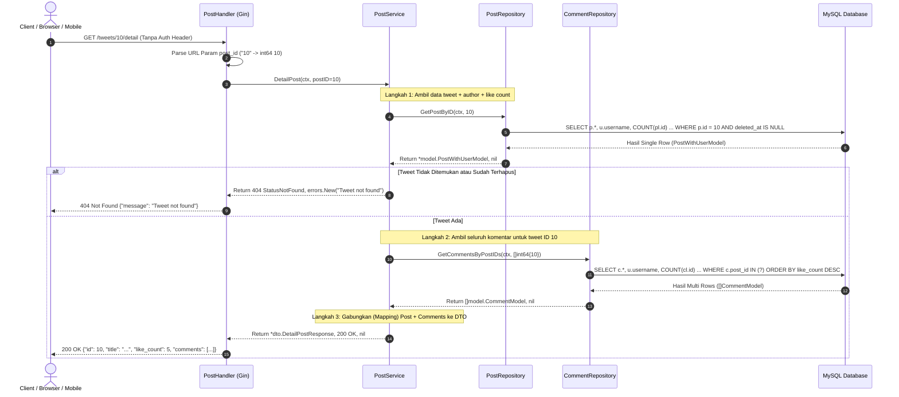

# Catatan Pembelajaran #12: Fitur Detail Tweet & Pola Eager Loading Komentar

Dokumentasi ini mencatat rangkuman arsitektur, kode, alur logika, alasan perancangan (*reason & the "why"*), bedah mendalam konsep pointer (`*` dan `&`), cara membaca query SQL kompleks (JOIN, LEFT JOIN, GROUP BY, Aggregate), serta komparasi lintas ekosistem (Laravel & Next.js/TypeScript) pada fitur **Melihat Detail Postingan / Tweet Beserta Komentarnya (`GET /tweets/:post_id/detail`)** pada project **go-tweets**.

---

## 1. Ringkasan Fitur yang Dibangun

1. **Endpoint Publik: `GET /tweets/:post_id/detail`**:
   - Berada di luar proteksi `AuthMiddleware` (`routeWithoutAuth`), artinya siapa pun (baik user yang login maupun pengunjung anonim/guest) dapat melihat detail tweet dan membaca komentar-komentarnya.
2. **Kompilasi Data Agregat (Rich Data Response)**:
   - Menampilkan detail tweet lengkap: ID, Judul, Konten, Data Pembuat (`Username`), Tanggal Dibuat, dan Jumlah Suka (`LikeCount`).
   - Menyertakan daftar komentar terkait yang diurutkan berdasarkan komentar paling populer (`ORDER BY like_count DESC`).
3. **Pola Pengambilan Data 2 Langkah (Two-Step Fetching / Eager Loading Pattern)**:
   - **Langkah 1**: Ambil data utama postingan via `postRepo.GetPostByID(...)`.
   - **Langkah 2**: Ambil seluruh komentar yang terhubung via `commentRepo.GetCommentsByPostIDs(...)`.
   - Menghindari *Cartesian Product* raksasa yang terjadi jika data post dan data komentar dipaksakan digabung dalam 1 query `JOIN` tunggal.
4. **Penerapan Clean Architecture & Cross-Repository Injection**:
   - `postService` menerima dependensi ganda: `postRepo` untuk entitas tweet dan `commentRepo` untuk entitas komentar.

---

## 2. Tabel Analogi Konsep (Golang vs Laravel vs Next.js)

| Komponen di Fitur Ini | Padanan di Laravel | Padanan di Next.js / TypeScript (Prisma) | Fungsi Utama |
| :--- | :--- | :--- | :--- |
| `routeWithoutAuth.GET(...)` | Route publik tanpa middleware `auth` | Route Handler publik `app/api/tweets/[id]/route.ts` | Endpoint yang dapat diakses publik/guest |
| `postRepo.GetPostByID` | `Post::withCount('likes')->find($id)` | `prisma.post.findUnique({ include: { _count: { select: { likes: true } } } })` | Mengambil detail tweet + jumlah like |
| `commentRepo.GetCommentsByPostIDs` | Eager Loading `$post->comments()->withCount('likes')` | `prisma.comment.findMany({ where: { postId }, include: { _count: ... } })` | Mengambil komentar milik tweet + jumlah like |
| Response DTO `DetailPostResponse` | `PostResource` / `PostJsonResource` | TypeScript Interface / Zod Response Type | Format JSON data gabungan untuk client |

---

## 3. Alur Data Runtime (Sequence Flow)



---

## 4. Bedah Mendalam: Cara Membaca Query SQL Kompleks (Deep Dive Query)

Bagian ini membedah secara kata per kata bagaimana database memproses dua query SQL di fitur ini.

### 🔍 Query 1: Mengambil Tweet, Author, dan Like Count (`get_post_by_id.go`)

```sql
SELECT 
    p.id, p.title, p.content, p.user_id, p.created_at, p.updated_at, 
    u.username, 
    COUNT(pl.id) as like_count
FROM posts as p
JOIN users as u ON p.user_id = u.id
LEFT JOIN post_likes as pl ON pl.post_id = p.id
WHERE p.id = ?
  AND p.deleted_at IS NULL
GROUP BY p.id, p.title, p.content, p.user_id, p.created_at, p.updated_at, u.username
```

#### Cara Mengeja & Membaca Logikanya:
1. **`FROM posts as p`**:  
   Ambil tabel utama `posts` dan beri nama panggilan singkat `p`.
2. **`JOIN users as u ON p.user_id = u.id` (INNER JOIN)**:  
   Hubungkan postingan dengan tabel `users` berdasarkan kecocokan ID pembuat.  
   *Kenapa pakai `JOIN` biasa (Inner Join)?* Karena setiap tweet **PASTI** memiliki seorang pemilik. Jika user tidak ada di database, tweet tersebut tidak valid.
3. **`LEFT JOIN post_likes as pl ON pl.post_id = p.id` (SANGAT PENTING!)**:  
   Hubungkan postingan dengan tabel `post_likes`.  
   *Kenapa WAJIB `LEFT JOIN` bukan `JOIN` biasa?*  
   Jika tweet tersebut **belum pernah di-like sama sekali (0 like)**, tabel `post_likes` tidak memiliki baris data untuk tweet itu. Jika kamu memakai `JOIN` biasa (Inner Join), tweet yang 0 like akan **hilang lenyap** dari hasil query! Dengan `LEFT JOIN`, tabel utama (`posts`) tetap ditampilkan meskipun tabel sebelah kanan (`post_likes`) kosong (`NULL`).
4. **`WHERE p.id = ? AND p.deleted_at IS NULL`**:  
   Pilih hanya tweet dengan ID yang diminta, dan pastikan tweet tersebut belum dihapus (Soft Delete filter).
5. **`COUNT(pl.id) as like_count` & `GROUP BY ...`**:  
   Fungsi `COUNT(pl.id)` menghitung berapa kali ID like muncul untuk postingan ini. Jika ada 5 orang yang menyukai tweet ini, `COUNT` bernilai `5`. Jika tidak ada, bernilai `0`.  
   *Kenapa wajib `GROUP BY`?* Karena SQL standar mengharuskan semua kolom non-agregat yang ada di `SELECT` didaftarkan di `GROUP BY` agar database tahu bagaimana cara mengelompokkan baris sebelum menjumlahkan count-nya.

---

### 🔍 Query 2: Mengambil Seluruh Komentar + Author + Like Count (`get_all_comments.go`)

```sql
SELECT 
    c.id, c.post_id, c.user_id, u.username, c.content, c.created_at, c.updated_at, 
    COUNT(cl.id) as like_count
FROM comments as c
JOIN users as u ON u.id = c.user_id
LEFT JOIN comment_likes as cl ON cl.comment_id = c.id
WHERE c.post_id IN (%s)
GROUP BY c.id, c.post_id, c.user_id, u.username, c.content, c.created_at, c.updated_at
ORDER BY like_count DESC
```

#### Cara Mengeja & Membaca Logikanya:
1. **Dynamic `IN (%s)` Clause**:  
   Klausa `WHERE c.post_id IN (?)` memungkinkan kita mengambil komentar untuk satu atau banyak tweet sekaligus secara efisien (*batch query*).
2. **`JOIN users as u ON u.id = c.user_id`**:  
   Mengambil nama (`username`) dari orang yang menulis komentar tersebut.
3. **`LEFT JOIN comment_likes as cl ON cl.comment_id = c.id`**:  
   Menghubungkan ke tabel like komentar agar kita bisa menghitung berapa orang yang menyukai masing-masing komentar.
4. **`ORDER BY like_count DESC`**:  
   Mengurutkan komentar berdasarkan jumlah suka terbanyak di posisi paling atas (seperti fitur *Top Comments* pada media sosial).

---

## 5. Masterclass: Memahami Pointer (`*` dan `&`) di Golang Secara Gamblang

Bagi programmer yang terbiasa dengan PHP/Laravel atau JavaScript/TypeScript, konsep pointer di Go sering kali terasa membingungkan. Mari kita bedah tuntas mental model-nya!

### A. Perbedaan Mendasar Simbol `*` vs `&`

```
   ┌──────────────────────────────────────────────────────────────┐
   │ VARIABEL REGULER : age := 25                                 │
   │ - Nilai Datanya  : 25                                        │
   │ - Alamat Memori  : 0x14000128008 (Lokasi fisik di RAM)       │
   └──────────────────────────────┬───────────────────────────────┘
                                  │
          &age (Ambil Alamat)     │      *p (Baca Nilai di Alamat)
          "Dimana rumah si age?"  │      "Siapa isi rumah di 0x140...?"
                                  ▼
   ┌──────────────────────────────────────────────────────────────┐
   │ POINTER          : p := &age                                 │
   │ - Tipe Data      : *int (Pointer to int)                     │
   │ - Nilai Datanya  : 0x14000128008                             │
   └──────────────────────────────────────────────────────────────┘
```

1. **Simbol `&` (Address-Of Operator)** $\rightarrow$ *"Minta Alamat Rumahnya!"*
   - Digunakan di depan variabel yang sudah ada: `&data.ID`.
   - Artinya: *"Saya tidak mau meng-copy nilainya, saya mau tahu alamat memori tempat variabel ini disimpan di RAM!"*
2. **Simbol `*` (Memiliki 2 Fungsi Bergantung Tempatnya)**:
   - **Sebagai TIPE DATA**: misal `*model.PostModel`.  
     Artinya: *"Variabel ini bukan berisi data struct, melainkan berisi alamat memori yang menunjuk ke sebuah PostModel"*.
   - **Sebagai OPERATOR (Dereference)**: misal `*ptr`.  
     Artinya: *"Tolong pergi ke alamat memori yang ditunjuk, lalu baca atau ubah data aslinya!"*.

---

### B. Studi Kasus Kode: Kenapa di `Scan` Harus Pakai `&`?

Di [`get_post_by_id.go`](file:///C:/Users/ferry/Documents/coding/GOLANG/go-tweets/internal/repository/post/get_post_by_id.go#L20):
```go
var result model.PostWithUserModel
err := row.Scan(&result.ID, &result.Title, &result.Content, ...)
```

#### Kenapa harus ada tanda `&` di depan setiap field?
- Secara bawaan, Go menganut prinsip **Pass by Value** (setiap kali kamu mengoper variabel ke fungsi, Go membuat duplikat/fotokopian variabel tersebut).
- Jika kamu menulis `row.Scan(result.ID)` tanpa `&`:  
  Fungsi `Scan` hanya akan mengisi data database ke **kertas fotokopian**, sedangkan variabel `result.ID` aslimu tetap kosong melompong (0 atau string kosong)!
- Dengan menulis `&result.ID`:  
  Kamu memberikan **kunci rumah / alamat memori asli** kepada fungsi `Scan`. Driver MySQL akan langsung mendatangi alamat memori tersebut dan mengisi nilainya langsung di tempat!

---

### C. Kenapa Method Receiver Pakai `(r *postRepository)`?

Perhatikan penulisan method:
```go
func (r *postRepository) GetPostByID(...)
//     ^^^^^^^^^^^^^^^
//     Pakai pointer *
```
1. **Mencegah Duplikasi Struct**: Struct repository memegang koneksi database `db *sql.DB`. Dengan memakai pointer `*postRepository`, Go tidak membuat fotokopi objek repository setiap kali method dipanggil.
2. **Konsistensi Mutasi**: Jika method memodifikasi internal state struct, modifikasi tersebut tersimpan di objek asli.

---

### D. Kapan Return Value Wajib Pakai Pointer (`*`) vs Value Biasa?

#### 1. Kasus Ambil 1 Data Tunggal (`GetPostByID`) $\rightarrow$ **Wajib Pointer (`*`)**:
```go
func (r *postRepository) GetPostByID(...) (*model.PostWithUserModel, error)
```
- **Alasannya:** Kita butuh kemampuan untuk mengembalikan **`nil`** jika data tidak ada di database:
  ```go
  if err == sql.ErrNoRows {
      return nil, nil // <-- HANYA BISA DILAKUKAN JIKA RETURN TYPE-NYA POINTER!
  }
  ```
  Jika kamu memakai value biasa `(model.PostWithUserModel, error)`, kamu **tidak bisa** menulis `return nil, nil` karena struct value tidak bisa bernilai `nil`.

#### 2. Kasus Ambil Banyak Data (`GetCommentsByPostIDs`) $\rightarrow$ **Disarankan Slice Value (`[]model.CommentModel`)**:
```go
func (r *commentRepository) GetCommentsByPostIDs(...) ([]model.CommentModel, error)
```
- **Alasannya:** Slice sendiri di balik layar adalah pointer ke memori array kontigu. Jika komentar tidak ada, slice cukup bernilai kosong `len == 0`. Menggunakan slice of value menjamin **tidak akan pernah ada crash `nil pointer dereference`** saat looping membaca komentar!

---

## 6. Bedah Kode File per File (Code Deep Dive)

### A. DTO Layer: `internal/dto/post_dto.go`

Membuat kontrak response komprehensif untuk halaman detail tweet:
```go
type (
    Comment struct {
        ID        int64  `json:"id"`
        Username  string `json:"username"`
        Content   string `json:"content"`
        LikeCount int64  `json:"like_count"`
        CreatedAt string `json:"created_at"`
        UpdatedAt string `json:"updated_at"`
    }

    DetailPostResponse struct {
        ID        int64     `json:"id"`
        Username  string    `json:"username"`
        Title     string    `json:"title"`
        Content   string    `json:"content"`
        LikeCount int64     `json:"like_count"`
        Comments  []Comment `json:"comments"`
        CreatedAt string    `json:"created_at"`
        UpdatedAt string    `json:"updated_at"`
    }
)
```

---

### B. Service Layer: `internal/service/post/detail_post.go`

Orkestrator dua domain (Post + Comment) yang elegan:
```go
func (s *postService) DetailPost(ctx context.Context, postID int64) (*dto.DetailPostResponse, int, error) {
    // 1. Ambil postingan utama
    post, err := s.postRepo.GetPostByID(ctx, postID)
    if err != nil {
        return nil, http.StatusInternalServerError, err
    }
    if post == nil {
        return nil, http.StatusNotFound, errors.New("Tweet not found")
    }

    // 2. Ambil seluruh komentar terkait postingan ini
    postIDs := []int64{post.ID}
    comments, err := s.commentRepo.GetCommentsByPostIDs(ctx, postIDs)
    if err != nil {
        return nil, http.StatusInternalServerError, err
    }

    // 3. Transformasi (Mapping) ke DTO Comment
    commentsMap := make([]dto.Comment, 0)
    for _, comment := range comments {
        commentsMap = append(commentsMap, dto.Comment{
            ID:        comment.ID,
            Username:  comment.Username,
            Content:   comment.Content,
            LikeCount: comment.LikeCount,
            CreatedAt: comment.CreatedAt.String(),
            UpdatedAt: comment.UpdatedAt.String(),
        })
    }

    // 4. Return respon gabungan
    return &dto.DetailPostResponse{
        ID:        post.ID,
        Username:  post.Username,
        Title:     post.Title,
        Content:   post.Content,
        LikeCount: post.LikeCount,
        Comments:  commentsMap,
        CreatedAt: post.CreatedAt.String(),
        UpdatedAt: post.UpdatedAt.String(),
    }, http.StatusOK, nil
}
```

---

### C. Handler Layer & Routing: `internal/handler/post/`

* **Membuka Akses Publik di `handler.go`:**
  ```go
  // Endpoint publik tanpa middleware JWT:
  routeWithoutAuth := h.api.Group("/tweets")
  routeWithoutAuth.GET("/:post_id/detail", h.DetailPost)
  ```
* **Handler Implementation (`detail_post.go`):**
  Mengambil parameter path `:post_id`, melakukan parsing ke integer, memanggil service, dan mengembalikan data berformat JSON.

---

## 7. Learning Corner: Pelajaran Emas & Gotchas

### 💡 Mengapa Compiler Menolak: `cannot use &postRepository as PostRepository (missing method)`?
Jika kamu menambahkan method pada `interface`, Go mengharuskan **struct yang mengimplementasikannya memiliki nama method dan signature yang sama persis**:
1. Ketika method `GetCommentsByPostIDs` dipindahkan fisiknya ke `commentRepository`, method itu **wajib dihapus dari interface `PostRepository`**.
2. Jika tidak dihapus, Go menganggap `postRepository` gagal memenuhi janji kontrak antarmukanya (*missing method*).

---

## 8. Rekomendasi Industri (Best Practice REST API)

1. **Pagination pada Komentar**:  
   Jika sebuah tweet viral memiliki 10.000 komentar, memuat semua komentar sekaligus dapat memperlambat database dan membebani bandwidth. Di masa depan, endpoint komentar dapat ditambahkan parameter pagination (misal: `?limit=10&page=1`).
2. **HTTP Status Code pada Parse Error**:  
   Di `detail_post.go`: jika `strconv.ParseInt` gagal (misal user mengakses `/tweets/abc/detail`), kembalikan status **`http.StatusBadRequest` (400)** daripada `500 Internal Server Error`.
