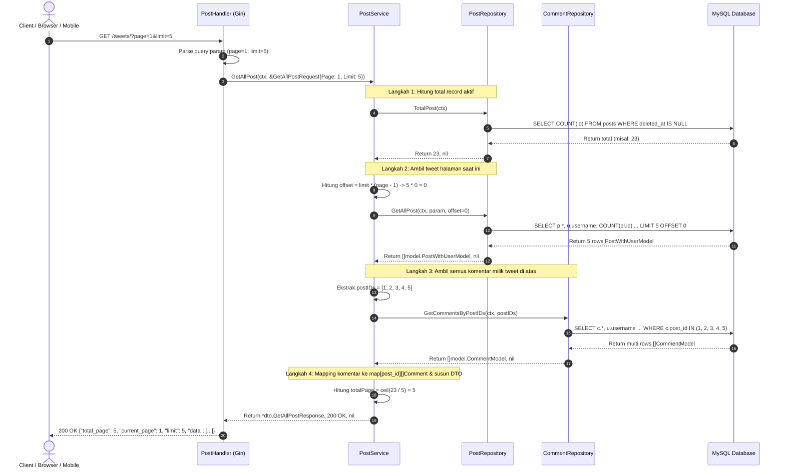

# Catatan Pembelajaran #13: Fitur Get All Tweets & Pagination (Offset-Based)

Dokumentasi ini mencatat arsitektur, implementasi kode, alur logika data, alasan perancangan (*reason & the "why"*), bedah query pagination (`LIMIT`, `OFFSET`, `COUNT`), mitigasi masalah N+1 via *in-memory grouping*, perbandingan lintas ekosistem (Laravel & Next.js/TypeScript), serta **Pelajaran Emas (Gotchas)** seputar alokasi slice di Go pada fitur **Mendapatkan Seluruh Postingan / Tweet dengan Paginasi (`GET /tweets/`)** pada project **go-tweets**.

---

## 1. Ringkasan Fitur yang Dibangun

1. **Endpoint Publik Berpaginasi: `GET /tweets/?page=1&limit=10`**:
   - Berada pada grup publik tanpa token (`routeWithoutAuth`), memungkinkan feed/timeline tweet dapat dibaca oleh publik tanpa harus login terlebih dahulu.
2. **Metadata Paginasi Standar Industri**:
   - Menghasilkan respon data yang dilengkapi informasi paginasi: `current_page`, `limit`, `total_page`, serta daftar postingan `data`.
3. **Efisiensi Kueri Database (Two-Step Fetching & In-Memory Hash Map)**:
   - Menghindari perangkap **N+1 Query Problem**: Daripada mengambil komentar satu per satu untuk setiap tweet di dalam looping, sistem mengambil seluruh tweet yang masuk halaman tersebut, mengumpulkan semua `post_id`, mengeksekusi 1 kueri komentar via `WHERE post_id IN (...)`, lalu memetakan (*grouping*) komentar ke tweet masing-masing menggunakan Go `map[int64][]dto.Comment` di memori ($O(1)$ lookup).
4. **Agregasi Data Tweet**:
   - Setiap tweet menampilkan author (`username`), jumlah like (`LikeCount`), dan daftar komentar terkait beserta like masing-masing komentar.

---

## 2. Tabel Analogi Konsep (Golang vs Laravel vs Next.js)

| Komponen di Fitur Ini | Padanan di Laravel | Padanan di Next.js / TypeScript (Prisma) | Fungsi Utama |
| :--- | :--- | :--- | :--- |
| `c.DefaultQuery("page", "1")` | `$request->query('page', 1)` | `searchParams.get('page') ?? '1'` | Mengambil parameter query string URL dengan nilai fallback |
| `dto.GetAllPostRequest` | FormRequest / DTO | Zod Query Schema / TS Type | Menampung parameter input paginasi |
| `r.postRepo.TotalPost` | `Post::count()` | `prisma.post.count()` | Menghitung total seluruh baris data aktif untuk `total_page` |
| `LIMIT ? OFFSET ?` | `->paginate($limit)` atau `->skip($offset)->take($limit)` | `prisma.post.findMany({ skip, take })` | Membatasi jendela data database per halaman |
| `commentsMap := make(map[...])` | Koleksi Eloquent `$posts->load('comments')` (Eager Loading) | In-Memory Grouping via `Map` atau `lodash.groupBy` | Mengelompokkan relasi komentar ke tweet induk tanpa query berulang |
| `math.Ceil(float64(total) / float64(limit))` | `LengthAwarePaginator::lastPage()` | `Math.ceil(total / limit)` | Menghitung total halaman berdasarkan pembulatan ke atas |

---

## 3. Alur Data Runtime (Sequence Flow)



---

## 4. Bedah Mendalam Query SQL Paginasi

### 🔍 1. Kueri Total Postingan (`total_post.go`)
```sql
SELECT COUNT(id) FROM posts
WHERE deleted_at IS NULL
```
- **Fungsi**: Mengetahui jumlah seluruh postingan aktif (yang belum di-soft delete).
- **Alasan Pemilihan `COUNT(id)`**: Menghitung primary key `id` lebih cepat dan optimal pada storage engine InnoDB MySQL daripada `COUNT(*)` pada tabel besar karena langsung memanfaatkan index clustered.

### 🔍 2. Kueri Daftar Postingan Berpaginasi (`get_all_post.go`)
```sql
SELECT 
    p.id, p.title, p.content, p.user_id, p.created_at, p.updated_at, 
    u.username, 
    COUNT(pl.id) as like_count
FROM posts as p
JOIN users as u ON u.id = p.user_id
LEFT JOIN post_likes as pl ON pl.post_id = p.id
WHERE p.deleted_at IS NULL
GROUP BY p.id, p.title, p.content, p.user_id, p.created_at, p.updated_at, u.username
ORDER BY p.created_at DESC
LIMIT ?
OFFSET ?
```

#### Cara Mengeja & Membaca Logikanya:
1. **`JOIN users as u ON u.id = p.user_id`**: Menghubungkan pembuat postingan (Inner Join). Postingan tidak valid jika pembuatnya tidak ada.
2. **`LEFT JOIN post_likes as pl ON pl.post_id = p.id`**: Mengaitkan tabel likes. Digunakan `LEFT JOIN` agar postingan yang belum pernah di-like sama sekali tetap tampil dengan `like_count = 0`.
3. **`WHERE p.deleted_at IS NULL`**: Menyaring postingan yang aktif saja (fitur Soft Delete).
4. **`GROUP BY p.id, ...`**: Mengelompokkan baris hasil join berdasarkan ID postingan agar fungsi agregat `COUNT(pl.id)` menghitung jumlah like per tweet secara spesifik.
5. **`ORDER BY p.created_at DESC`**: Menampilkan postingan paling baru di urutan teratas (kronologis terbalik layaknya Twitter/X).
6. **`LIMIT ? OFFSET ?`**:
   - `LIMIT`: Berapa banyak data yang diambil untuk satu halaman (misal: 10).
   - `OFFSET`: Berapa banyak baris data terdahulu yang dilewati/dilompati sebelum mulai mengambil baris. Rumusnya:  
     $$\text{offset} = \text{limit} \times (\text{page} - 1)$$

---

## 5. Bedah Kode File per File

### A. DTO Layer (`internal/dto/post_dto.go`)
```go
type (
	GetAllPostRequest struct {
		Limit int64 `param:"limit"`
		Page  int64 `param:"page"`
	}

	GetAllPostResponse struct {
		TotalPage   int64                `json:"total_page"`
		CurrentPage int64                `json:"current_page"`
		Limit       int64                `json:"limit"`
		Data        []DetailPostResponse `json:"data"`
	}
)
```
- **The "Why"**:
  - `GetAllPostRequest` membungkus parameter paginasi agar controller dan service berkomunikasi menggunakan tipe data terstruktur, bukan melewatkan parameter liar bertipe integer lepas.
  - `GetAllPostResponse` adalah format respons seragam standar API. Client (seperti Next.js frontend / Flutter) membutuhkan `total_page` dan `current_page` untuk merender komponen UI pagination atau infinite scroll.

---

### B. Handler Layer (`internal/handler/post/get_all_post.go`)
```go
func (h *PostHandler) GetAllPost(c *gin.Context) {
	ctx := c.Request.Context()
	pageStr := c.DefaultQuery("page", "1")
	limitStr := c.DefaultQuery("limit", "1")

	page, _ := strconv.ParseInt(pageStr, 10, 64)
	limit, _ := strconv.ParseInt(limitStr, 10, 64)

	param := dto.GetAllPostRequest{
		Page:  page,
		Limit: limit,
	}

	result, statusCode, err := h.postService.GetAllPost(ctx, &param)
	if err != nil {
		c.JSON(statusCode, gin.H{
			"message": err.Error(),
		})
		return
	}

	c.JSON(statusCode, result)
}
```
- **Cara Baca Kodingan**:
  - `c.DefaultQuery("page", "1")`: "Gin, tolong baca query parameter `?page=...` dari URL. Jika client tidak mengirim parameter ini di URL, gunakan string `'1'` sebagai nilai *default*."
  - `strconv.ParseInt(pageStr, 10, 64)`: Mengonversi string basis 10 menjadi integer 64-bit (`int64`).
  - `h.postService.GetAllPost(ctx, &param)`: Meneruskan konteks dan pointer struct request ke layer service.

---

### C. Service Layer (`internal/service/post/get_all_post.go`)
```go
func (s *postService) GetAllPost(ctx context.Context, param *dto.GetAllPostRequest) (*dto.GetAllPostResponse, int, error) {
	// 1. Ambil total post untuk kalkulasi halaman
	totalPost, err := s.postRepo.TotalPost(ctx)
	if err != nil {
		return nil, http.StatusInternalServerError, err
	}

	// 2. Ambil data post sesuai limit dan offset
	offset := param.Limit * (param.Page - 1)
	posts, err := s.postRepo.GetAllPost(ctx, param, int(offset))
	if err != nil {
		return nil, http.StatusInternalServerError, err
	}

	// 3. Kumpulkan seluruh ID post untuk mengambil komentar
	postIDs := make([]int64, 0, len(posts))
	for _, post := range posts {
		postIDs = append(postIDs, post.ID)
	}
	comments, err := s.commentRepo.GetCommentsByPostIDs(ctx, postIDs)
	if err != nil {
		return nil, http.StatusInternalServerError, err
	}

	// 4. In-Memory Grouping Komentar berdasarkan Post ID
	commentsMap := make(map[int64][]dto.Comment)
	for _, comment := range comments {
		commentsMap[comment.PostID] = append(commentsMap[comment.PostID], dto.Comment{
			ID:        comment.ID,
			Username:  comment.Username,
			Content:   comment.Content,
			LikeCount: comment.LikeCount,
			CreatedAt: comment.CreatedAt.String(),
			UpdatedAt: comment.UpdatedAt.String(),
		})
	}

	// 5. Susun hasil akhir (mapping post + comments)
	var data []dto.DetailPostResponse
	for _, post := range posts {
		comments := commentsMap[post.ID]
		if comments == nil {
			comments = []dto.Comment{} // Cegah JSON keluar sebagai null
		}
		data = append(data, dto.DetailPostResponse{
			ID:        post.ID,
			Username:  post.Username,
			Title:     post.Title,
			Content:   post.Content,
			LikeCount: post.LikeCount,
			Comments:  comments,
			CreatedAt: post.CreatedAt.String(),
			UpdatedAt: post.UpdatedAt.String(),
		})
	}

	// 6. Hitung total halaman (pembulatan ke atas)
	totalPage := int64(math.Ceil(float64(totalPost) / float64(param.Limit)))

	result := dto.GetAllPostResponse{
		Limit:       param.Limit,
		CurrentPage: param.Page,
		TotalPage:   totalPage,
		Data:        data,
	}

	return &result, http.StatusOK, nil
}
```

---

## 6. Learning Corner & Pelajaran Emas (Gotchas & Aha! Moments)

### 💡 Pelajaran Emas 1: Jebakan Alokasi Slice di Go (`make([]T, len)` vs `append`)

Perhatikan baris kode asli:
```go
// ⚠️ HATI-HATI: JEBAKAN NILAI NOL (ZERO VALUES)
postIDs := make([]int64, len(posts))
for _, post := range posts {
    postIDs = append(postIDs, post.ID)
}
```
#### Gejala Masalah (Symptom):
Jika `len(posts)` adalah 3 (misal ID tweet: 101, 102, 103), isi slice `postIDs` yang dihasilkan bukanlah `[101, 102, 103]`, melainkan:
```go
[0, 0, 0, 101, 102, 103] // Berisi 6 elemen dengan tiga angka 0 di depan!
```

#### Mengapa Terjadi? (The Root Cause):
- Fungsi `make([]T, length, capacity)` di Go: jika parameter kedua (`length`) diisi angka $N$, Go **langsung mengalokasikan $N$ slot elemen dan mengisinya dengan default zero value** (`0` untuk tipe angka).
- Fungsi `append(...)` di Go selalu menambahkan elemen baru **setelah elemen terakhir dari panjang slice saat ini**.
- Akibatnya, 3 slot pertama bernilai `0`, dan elemen yang di-append berada di slot ke-4, ke-5, dan ke-6.
- Query SQL `WHERE post_id IN (0, 0, 0, 101, 102, 103)` akan mencari komentar untuk `post_id = 0` (yang mubazir).

#### Solusi & Kaidah Emas (The Golden Rule):
Gunakan salah satu dari dua cara berikut:
1. **Opsi Rekomendasi (Length 0 dengan Capacity Terdefinisi)**:
   ```go
   postIDs := make([]int64, 0, len(posts)) // length = 0, cap = len(posts)
   for _, post := range posts {
       postIDs = append(postIDs, post.ID)
   }
   ```
2. **Opsi Direct Index Assignment (Tanpa Append)**:
   ```go
   postIDs := make([]int64, len(posts))
   for i, post := range posts {
       postIDs[i] = post.ID
   }
   ```

---

### 💡 Pelajaran Emas 2: Pembagian Integer & `math.Ceil` di Go

Perhatikan rumus penghitungan total halaman:
```go
totalPage := int64(math.Ceil(float64(totalPost) / float64(param.Limit)))
```

#### Mengapa Wajib di-cast ke `float64` Terlebih Dahulu?
Di Go, operasi aritmatika pada dua integer bersifat **Integer Division** (selalu membuang desimal/dibulatkan ke bawah secara otomatis):
- `int64(23) / int64(5)` menghasilkan integer `4` (bukan `4.6`).
- Jika langsung dipanggil `math.Ceil(4)`, hasilnya tetap `4`! Padahal 23 postingan dengan limit 5 butuh **5 halaman** agar 3 postingan sisa di halaman terakhir tetap terbaca.
- Oleh karena itu, kedua angka harus di-cast ke `float64` agar menghasilkan `4.6`, kemudian `math.Ceil(4.6)` membulatkannya ke atas menjadi `5.0`, lalu di-cast kembali ke `int64(5)`.

---

### 💡 Pelajaran Emas 3: Mencegah Nilai `null` pada JSON Array Kosong

Perhatikan baris berikut di service:
```go
comments := commentsMap[post.ID]
if comments == nil {
    comments = []dto.Comment{}
}
```

#### Mengapa Pengecekan Ini Sangat Krusial?
- Di Go, variabel slice yang belum diinisialisasi atau hasil lookup map yang kuncinya tidak ada bernilai **`nil`**.
- Standar serializer `encoding/json` di Go memperlakukan slice `nil` sebagai **`null`** dalam JSON:
  ```json
  "comments": null
  ```
- Ini adalah sumber umum bug di frontend modern (Next.js / React / Flutter) yang biasanya langsung memanggil `.map()` atau `.length`:
  ```javascript
  // Error di Frontend: TypeError: Cannot read properties of null (reading 'map')
  post.comments.map(c => ...) 
  ```
- Dengan menginisialisasi slice kosong `[]dto.Comment{}`, JSON serializer dijamin menghasilkan:
  ```json
  "comments": []
  ```
  yang aman dan ramah untuk frontend client.

---

## 7. Analisis Trade-off & Best Practice Industri

### ⚖️ Trade-off: Offset Pagination vs Cursor-based Pagination
Pendekatan yang kita buat adalah **Offset-based pagination** (`LIMIT x OFFSET y`).

| Parameter | Offset Pagination (`LIMIT/OFFSET`) | Cursor-based Pagination (`WHERE id < cursor`) |
| :--- | :--- | :--- |
| **Kelebihan** | Sangat mudah diimplementasikan, mendukung direct page jump (lompat ke halaman 5, 10, dst), mudah menghitung `total_page`. | Sangat cepat di skala jutaan baris data, konsisten saat ada postingan baru (tidak ada data duplikat/bergeser saat scroll). |
| **Kekurangan** | Performa menurun drastis di halaman besar (`OFFSET 1000000` memaksa DB membaca 1 juta row lalu membuangnya). Data bisa bergeser jika ada insert baru di halaman 1 saat user di halaman 2. | Tidak bisa langsung lompat ke halaman tertentu (hanya bisa Prev/Next atau Infinite Scroll), sulit menghitung total halaman. |
| **Rekomendasi Industri** | Cocok untuk tabel admin, data dengan ukuran kecil-menengah (< 100.000 row). | Standar de-facto untuk media sosial / timeline publik berkecepatan tinggi (Twitter, Instagram, TikTok feeds). |

### 🛡️ Best Practice Industri Tambahan
1. **Batas Maksimal Limit (Max Limit Guard)**:
   Hindari mengizinkan user meminta `?limit=100000`. Tambahkan validasi: jika `limit > 100` atau `limit <= 0`, paksa kembali ke nilai aman (misal default 10, max 50) untuk mencegah serangan DoS (Memory Exhaustion).
2. **Database Indexing**:
   Pastikan tabel `posts` memiliki composite index pada `(deleted_at, created_at)` agar proses `WHERE deleted_at IS NULL ORDER BY created_at DESC` tidak melakukan full table scan.
